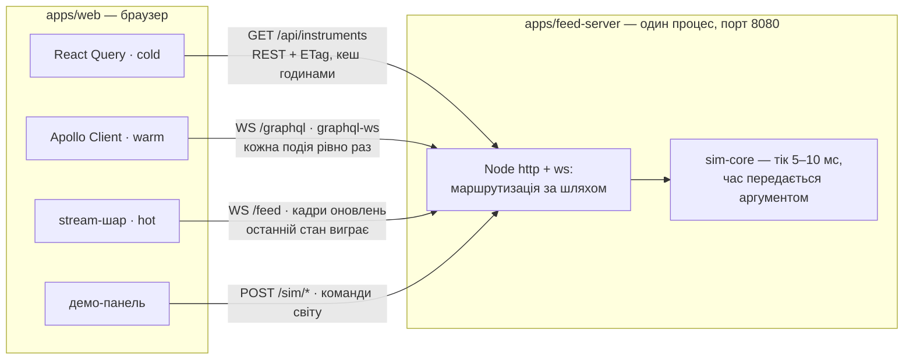
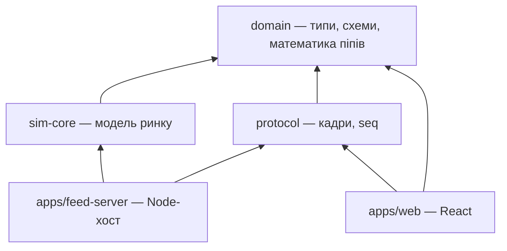
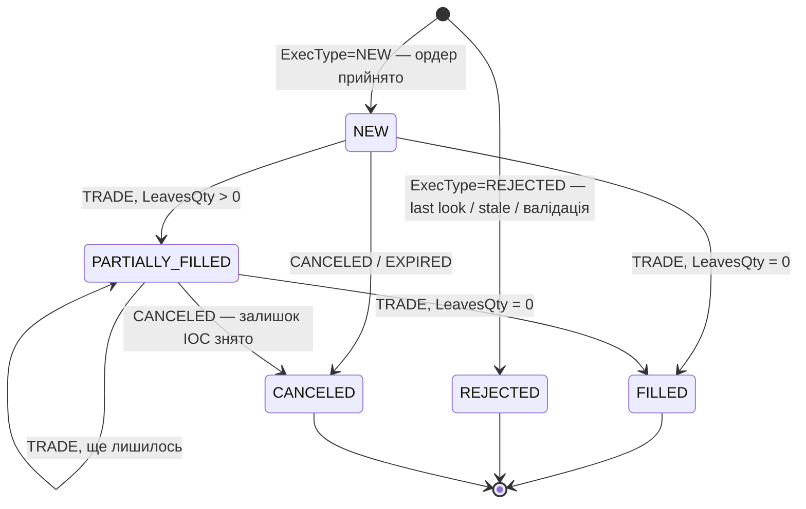
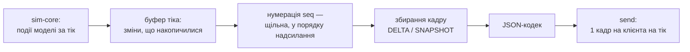
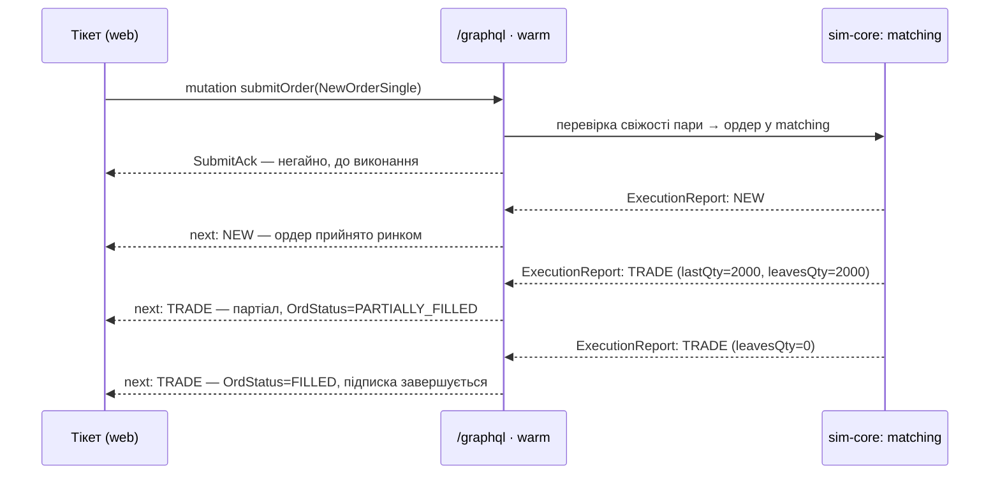
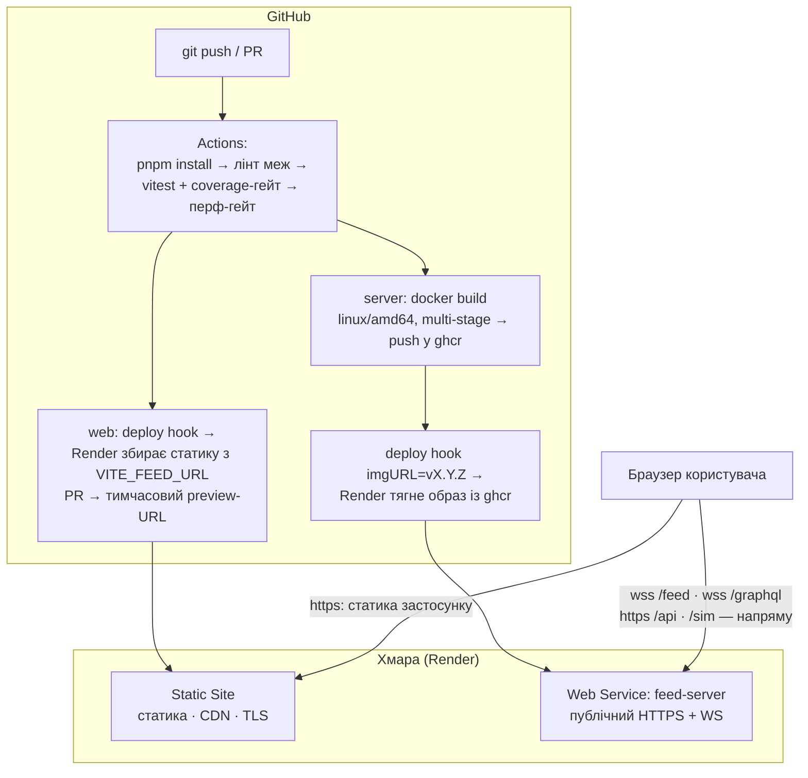

# FX Ladder — архітектура бекенду

> **Компонент:** feed-server + симулятор ринку для FX Ladder.
> **Статус:** draft, до реалізації · розширена редакція з обґрунтуваннями й теорією
> **Дата:** 2026-08-01
> **Базовий документ:** [FX_LADDER_BUSINESS_SPEC.md](FX_LADDER_BUSINESS_SPEC.md) — усі FR/NFR/AC-посилання звідти.
> **Ціль розгортання:** Render (Static Site + Web Service, free-інстанс) — ревізія ADR-11.

---

## Як читати цей документ

Кожен розділ побудовано за однією схемою: **рішення → чому саме воно → теорія, яка за ним стоїть → діаграма з поясненням**. Теоретичні відступи позначені підзаголовком «Теорія: …» — їх можна пропускати, якщо предмет знайомий, але саме вони перетворюють набір тверджень на аргументацію, яку можна захистити вголос. Кожна діаграма супроводжується абзацом «Що показує діаграма» — діаграма без пояснення в архітектурному документі не має цінності, бо читач не знає, на що дивитися.

Документ свідомо не містить псевдокоду. Все, що схоже на код, — це або **контракти** (розкладка байтів, поля повідомлень, тіла HTTP-запитів), або **діаграми**. Контракт — це те, про що домовляються дві сторони; його не можна «переказати приблизно», тому він записаний точно. Логіка ж описана словами: якщо рішення неможливо пояснити без коду, це зазвичай означає, що рішення ще не додумане.

---

## 0. Роль цього бекенду

Бекенд тут — не заглушка для UI. Це важливо проговорити, бо типовий шлях для демо-проєкту — «мокнути сервер, який віддає красиві цифри» — тут не працює принципово. Такий мок вміє лише happy path: він показує потік, але не вміє його *зламати за командою*, а отже, половина функціональних вимог (усе, що стосується розривів, протухання, відхилень ордера) залишається неперевіреною і непоказаною. Тому бекенд виконує три роботи одночасно, і кожна з них — повноцінний замовник архітектури:

1. **Двигун демо.** Генерує потік, який робить фронтенд показуваним: 50 000 оновлень/с, розриви, протухання котирувань, новинні сплески — усе за командою з панелі. Демо — це вистава з режисером, а не спостереження за випадковістю: якщо сплеск волатильності стається «коли пощастить», показати його рекрутеру за 5 хвилин неможливо.

2. **Тестова опора.** Кожен критерій приймання AC-04…AC-08 сформульований у стилі «*коли стається збій X, інтерфейс робить Y*». Щоб написати такий тест, потрібно вміти **навмисно спричинити** збій X — розірвати з'єднання без прощання, викинути 40 sequence-номерів, заморозити одну пару. Без керованого бекенду ці тести неможливо написати взагалі; з ним вони перетворюються на кілька HTTP-викликів.

3. **Тренажер стеку вакансії.** Кожен модуль або закриває FR/NFR, або дає місце відпрацювати технологію з JR-0000102383. Це фільтр проти інженерного самозахоплення: якщо шматок системи не потрібен ані вимогам, ані навчальній цілі — його не будуємо, хоч би яким цікавим він був.

**Стеля серверної інженерії.** З трьох робіт вище випливає межа, яку варто назвати вголос, бо вона керує половиною рішень у цьому документі: сервер тут — **стенд для фронтенду**, і його оптимізують рівно доти, доки вузьким місцем не стає браузер. Далі кожна серверна оптимізація перестає породжувати клієнтські проблеми — а породжувати їх і є її роботою. Тому фільтр з пункту 3 має другий бік, і саме він вирішує спірні випадки: механізм лишається, якщо він змінює те, що клієнтський код **бачить або мусить обробити**; якщо він лише полегшує життя серверу — його місце в беклозі. Звідси й цільові 50 000 оновлень/с: це не демонстрація серверної сили, а **необхідний вхід** — рівно той темп, на якому в браузері виникає проблема, заради якої будується весь клієнтський стрім-шар. Сервер зобов'язаний цей темп видати; робити це елегантніше, ніж треба для його видачі, — уже не його робота. Це рішення, а не економія: усе свідомо не збудоване назване вголос там, де його логічно шукати, — у відкликаних ADR (04, 07, 09) і в беклозі плану реалізації.

> ⚠️ **Файл робочий.** Розділ 2 і «чеки розуміння» з розділу 13 — для вас, не для
> роботодавця. У публічний репозиторій іде переклад без них; ADR-и лишаються — вони
> якраз і є сигналом «архітектурної власності» з вакансії.

---

## 1. Цілі та нецілі

Цілі — це операційне визначення слова «готово»: список властивостей, які система мусить мати, щоб проєкт вважався завершеним. Нецілі не менш важливі: явно записана неціль — це щеплення від розповзання скоупу. Коли посеред реалізації з'явиться спокуса «а давай ще додамо базу», відповідь уже написана й аргументована — не доведеться сперечатися з самим собою на емоціях.

**Цілі:**

- **Потік котирувань і глибини з керованою частотою до 50 000 оновлень/с** (NFR-01). «Керованою» — ключове слово: частота задається ззовні, а не «скільки вийде», бо демо-сценарії потребують точних режимів навантаження. Ці 50 000 існують не заради серверного рекорду, а тому, що саме на такому темпі інтерфейс починає ламатися — і має не зламатися (розділ 0).
- **Чесна семантика достовірності**: sequence-номери, heartbeat, детекція розривів, розрізнення штатного й аварійного закриття (FR-17…21). «Чесна» означає: клієнт може *довести*, що бачить актуальні й повні дані, а не сподіватися на це.
- **Життєвий цикл ордера з чесною граматикою подій**: партіали, послідовність `ExecType` / `OrdStatus`, last look і відмови — рівно те, що інтерфейс мусить правильно зібрати й показати (FR-08…16). Самі філи скриптовані; чому цього достатньо — розділ 5.5 і відкликаний ADR-04.
- **Повна керованість ззовні**: будь-який сценарій демо і будь-який E2E-тест — це серія HTTP-викликів. Симулятор — це система, якій *наказують*, а не за якою *спостерігають*.
- **Детермінізм**: однаковий seed → однаковий потік → стабільні тести. Це фундамент тестової стратегії (розділ 11): флейкі-тести — це майже завжди прихований недетермінізм.
- **Живий демо-лінк на Render**: рекрутер відкриває URL і бачить справжні WebSockets через справжню мережу — з реальними проксі, таймаутами й реконектами, а не їх імітацією на localhost.

**Нецілі — свідомо:**

| Не робимо | Чому |
|---|---|
| База даних | Стан у пам'яті; рестарт = новий торговий день. Жоден FR не вимагає переживати рестарт, а БД тягне за собою міграції, серіалізацію, ще один сервіс у деплої — усе це вартість без покупця. Деталі — ADR-10 |
| Автентифікація | Поза скоупом спеки (5.2). Дані синтетичні, збиток від «зламу» — нуль; захист control plane розібраний у розділі 8 |
| Справжній FIX-двигун | FIX-сесії (logon, resend, sequence reset) — окрема велика інженерія без цінності для UI-демо. Досить **словника** FIX у назвах полів — саме він просочується в реальні API і саме його впізнає інтерв'юер (розділ 5.6) |
| Kubernetes, горизонтальне масштабування | Один процес обслуговує стенд із запасом; жодного FR не закриває друга репліка, а оркестрація — операційна вартість без покупця (розділ 9) |
| Персистентність watchlist | FR-03 закривається localStorage на фронтенді; серверний стан для цього — гармата по горобцях |

---

## 2. Мапа освоєння технологій *(робочий розділ)*

Мета проєкту — не «мати бекенд», а **вийти зі співбесіди, вміючи говорити про кожен
пункт вакансії з власного досвіду**. Тому мапа читається у три колонки: технологія →
де вона живе в цій архітектурі → яке *речення зі співбесіди* ви зможете вимовити після
реалізації. Третя колонка — найважливіша: вона перевіряє, що технологія використана
змістовно, а не «для галочки в README».

| Вимога вакансії | Де в цій архітектурі | Що вмієте після |
|---|---|---|
| **Real-time high-throughput UI** | Батчинг у кадри на сервері + **клієнтський** перемикач наївного режиму: оновлення стану на кожне повідомлення проти коалесингу в `requestAnimationFrame` (розд. 6.4) | Цифри напам'ять: 50k оновлень у 100–200 кадрах проти 50k повідомлень (20 мкс бюджету на кожне), ~6 МБ/с у JSON проти ~800 КБ/с у бінарному форматі; чому per-message `setState` вбиває рендер і що дає коалесинг у кадр rAF |
| **WebSockets під потоком** | feed-server на Node + `ws`: батчинг у кадри, heartbeat, seq, коди закриття (розд. 6–7) | Обидва боки контракту WS: кадри замість повідомлень, детекція розривів за номерами, різна реакція на різні коди закриття, поведінка WS за реальним проксі |
| **Apollo / GraphQL** | Warm plane: schema, mutation `submitOrder`, subscription `executionReports` через graphql-ws (розд. 7.3) | Життєвий цикл subscription; аргументована відповідь «чому GraphQL поруч із WS» |
| **TanStack React Query** | Cold plane: REST + ETag + Cache-Control (розд. 7.2) | Узгодження `staleTime` із серверними заголовками; кеш як контракт, не як магія |
| **Vitest, 100 % coverage** | sim-core: чистий TS, нуль I/O (розд. 5) | Покриття без моків файлової системи й мережі; property-тести на інваріантах |
| **Playwright, мокінг** | Control plane (розд. 8) | E2E, які **наказують** світу, а не чекають таймаутів; сим — це мок, піднятий до продукту |
| **Zod** | Спільні схеми в `domain`: control plane, конфіги, тіла запитів (розд. 4, 8) | Одна схема — три споживачі: валідація на сервері, RHF на клієнті, типи всюди |
| **pnpm monorepo, Vite** | Workspace із 3 пакетів + 2 застосунків (розд. 4) | Межі пакетів, напрям залежностей, спільні типи наскрізь через стек |
| **CI/CD** | GitHub Actions: тести → coverage-гейт → перф-гейт → деплой статики й контейнера на Render; PR-preview середовища Render (розд. 9, 10) | Розмова «як тримати NFR зеленими» + справжній пайплайн до хмари, а не «працює локально» |
| **React perf: хуки, контекст** | Форма протоколу: оновлення ключовані парою → маршрутизація повз React-стан (розд. 6) | Обґрунтування NFR-03 від дроту до пікселя, а не «ми додали memo» |
| **AG Grid** | `/sim/blotter` генерує 5 000 угод для AC-11 | Дані для навантаження блоттера існують не «на око» |
| **RHF + Zod (фронт)** | Ті самі Zod-схеми ордера з `domain` | Валідація тікета і сервера — буквально один код |
| **Kubernetes** *(valued)* | Прямо не тренується: застосунок пакується в контейнер і котиться в кероване середовище (розд. 9) | Чесно окреслена межа: «кластер руками не ганяв; вмію спакувати сервіс у образ і викотити його пайплайном» — межа, названа прямо, звучить сильніше за розмиту всюдисущість |

Не тренує: мікрофронтенди. Чесно лишаємо за межами — краще одна свідома прогалина, ніж
картонна декорація «в нас є module federation», яка розсипається на другому питанні.

---

## 3. Огляд: три плани даних

Це центральне рішення всієї архітектури, і його треба зрозуміти до кінця, бо решта документа — його наслідки. Дані діляться не за фічами («модуль котирувань», «модуль ордерів»), а за **температурою і гарантією доставки**. Це прямий наслідок принципу з глосарія бізнес-спеки: *ціни можна проріджувати, події — ні*.

### Теорія: температура даних і гарантії доставки

**Температура** — це частота зміни даних. Довідник інструментів змінюється раз на місяці (холодні дані). Стан ордера змінюється кілька разів за його життя — при відправці, при кожному філі (теплі). Котирування змінюються десятки тисяч разів на секунду (гарячі). Температура визначає, *скільки* даних тече, а отже — які оптимізації доречні.

**Гарантія доставки** — це відповідь на питання «що станеться, якщо клієнт пропустить повідомлення». У розподілених системах класично розрізняють семантики *at-most-once* (може загубитися), *at-least-once* (може продублюватися) і *exactly-once* (рівно раз). Але для наших даних корисніший інший розріз — **за цінністю проміжних станів**:

- **Котирування — це стан, а не подія.** Якщо ціна за мілісекунду пройшла 1.0851 → 1.0852 → 1.0853, а клієнт побачив лише 1.0851 і 1.0853, він *нічого не втратив*: торгове рішення ухвалюється за поточною ціною, а не за траєкторією. Тут діє семантика «**останній стан виграє**» (last value wins), і саме вона легалізує проріджування проміжних станів — двічі: на клієнті, де оновлення злипаються в один кадр рендера (розділ 6.4), і на дроті після розриву, де втрачене не дозапитується, а перекривається свіжим снапшотом (розділ 6.2).
- **Виконання ордера — це подія, а не стан.** Філ на 2 мільйони, який клієнт не побачив, — це неправильна позиція, неправильний P&L і неправильне торгове рішення далі. Пропущену подію не можна «замінити наступною»: наступна подія *залежить* від пропущеної (CumQty накопичується). Тут потрібна доставка **кожної події рівно раз і в порядку**.

Ці дві семантики **несумісні в одному каналі**. Якщо змішати ціни й філи в один потік, доведеться обрати одне з двох зол: або застосувати до всього найсуворішу гарантію — і тоді жодне цінове оновлення не можна ні втратити, ні злити при рендері, тобто клієнт зобов'язаний окремо обробити кожне з десятків тисяч, і саме на цьому інтерфейс і вмирає; або дозволити втрати всьому — і тоді одного дня загубиться філ, і система збреше про гроші. Розділення каналів — не архітектурна естетика, а єдиний спосіб дати кожному типу даних його правильну гарантію.

### Три плани

| План | Дані | Транспорт | Семантика доставки | Клієнтський шар |
|---|---|---|---|---|
| **Cold** | Довідник інструментів | REST + ETag | кешовано годинами | React Query |
| **Hot** | Котирування, глибина | WS `/feed`, кадрами | **останній стан виграє**; проміжні можна втрачати | власний stream-шар |
| **Warm** | Ордери: ack → working → fill / reject | GraphQL по WS `/graphql` | **кожна подія рівно раз**, у порядку | Apollo |

Зверніть увагу, як транспорт випливає із семантики, а не з моди (це зафіксовано як ADR-02). Cold-даним потрібне HTTP-кешування — отже REST із правильними заголовками. Hot-даним потрібен дешевий масовий апдейт і дозвіл на втрати — отже власний кадровий формат поверх WS із батчингом. Warm-даним потрібні типізовані впорядковані події з підтвердженою доставкою — отже GraphQL subscriptions. Кожен транспорт має *предметну причину існування*, і саме тому кожен клієнтський шар (React Query, Apollo, власний stream-шар) має що робити, а не висить декорацією.

Усі плани живуть в **одному процесі на одному порту** — розводяться вони URL-шляхами. Причин дві. Перша — обмеження хостингу: ingress перед контейнером відкриває назовні одну точку входу (розділ 9). Друга — спрощення: один порт означає нуль CORS-проблем між власними планами, одну конфігурацію TLS, один процес для деплою і моніторингу. Мікросервісне розділення тут не купує нічого: плани й так ізольовані *семантикою*, а не мережею.



**Що показує діаграма.** Чотири стрілки зліва — це чотири різні *контракти*, а не чотири з'єднання до «одного API». Кожна стрілка підписана своєю семантикою доставки — це головне, що треба винести з картинки. Праворуч видно, що всі контракти сходяться в один процес: сервер дивиться на шлях запиту і роздає його відповідному обробнику, а джерело правди для всіх — одне ядро `sim-core`, якому час подається ззовні (чому це критично — розділ 4).

### Хости ядра

`sim-core` має рівно один продакшн-хост — Node усередині feed-server. Первісний задум тримав другий хост — Web Worker у браузері (офлайн-демо без сервера, локальний хост для E2E); після переїзду демо в хмару його **знято повністю** (ревізія ADR-03). Кожну з ролей другого хоста закриває дешевший механізм:

1. **Детермінізм E2E** — Playwright у CI ганяється проти локального feed-server: хмарної мережі в контурі немає, отже немає і її флейків (розділ 11);
2. **Фолбек співбесіди** — той самий сервер, запущений локально (`docker run` або dev-режим): якщо мережа закладу чи хмара відмовили, демо йде з localhost;
3. **Дисципліна чистого ядра** — її тримає лінтер меж із забороною I/O і глобального часу (розділ 4); щоденна збірка у другому середовищі для цього доказу не потрібна.

Клієнтський stream-шар відтак говорить із `/feed` напряму, без проміжної абстракції транспорту: єдина реалізація не заслуговує на інтерфейс. Sans-I/O дисципліна ядра від зняття Worker-а не слабшає — вона й далі купує тести без моків і чесні 100 % покриття (NFR-10); просто її доказ — лінтер і збірка, а не другий хост.

---

## 4. Монорепо

```
packages/
  domain/       типи, довідник пар, математика піпів, Zod-схеми повідомлень
  sim-core/     симулятор: чистий TS, нуль I/O, нуль DOM, нуль таймерів
  protocol/     формат кадрів, семантика seq, версія протоколу
apps/
  feed-server/  Node http + ws; хост sim-core; Docker-образ
  web/          React; клієнт трьох планів даних
```

### Теорія: напрям залежностей

Правило, за яким проведені межі: **залежності показують від мінливого до стабільного, і ніколи навпаки**. `domain` — найстабільніший шар (що таке валютна пара і піп, не зміниться від переїзду на інший транспорт), тому від нього залежать усі, а він — ні від кого. Застосунки — найбільш мінливий шар (сьогодні `ws` і React, завтра що завгодно), тому від них не залежить ніхто. Якби `sim-core` імпортував щось із `feed-server`, будь-яка зміна транспорту тягла б за собою перетестування моделі ринку — тобто найстабільніше ставало б заручником найхиткішого.



**Що показує діаграма.** Стрілка означає «залежить від». Усі стрілки течуть *вниз*, до `domain`, і жодна — вгору чи вбік між `sim-core` і `protocol`: модель ринку не знає, як її серіалізують, а кодек не знає, звідки беруться числа. `sim-core` імпортує лише сервер: після зняття Worker-хоста (ADR-03) браузеру модель ринку не потрібна — web споживає `protocol` і `domain`. Застосунки — тонкі обгортки, які з'єднують готові пакети з конкретним середовищем.

**Правила залежностей** (порушення — помилка збірки, перевіряється лінтером меж):

- `domain` не залежить ні від чого;
- `sim-core` і `protocol` залежать лише від `domain`;
- застосунки залежать від пакетів; пакети не знають про застосунки;
- у `sim-core` заборонені імпорти Node (`fs`, `net`, `timers`) і будь-який глобальний час: **час — завжди аргумент**. Єдина точка входу ядра — виклик «просунься до моменту now», який повертає список подій симуляції, що сталися відтоді.

Чому саме лінтер, а не домовленість у README: домовленості ерозують. Через три місяці, о другій ночі, під дедлайн хтось (найімовірніше — ви самі) імпортує `Date.now` у ядро, «бо так швидше», і дисципліна закінчиться. Правило, яке валить збірку, не ерозує.

### Теорія: чому «час — аргумент» — це не педантизм

Патерн має усталені назви: **sans-I/O** (так будують протокольні бібліотеки на кшталт h11) або **functional core, imperative shell**. Ідея: ядро — це чиста функція станів. Йому подають на вхід поточний стан, команди і час; воно повертає новий стан і список подій. Увесь I/O — таймери, сокети, `postMessage` — живе в тонкій оболонці зовні (у хостах).

Що це купує конкретно тут:

1. **Тести без моків — і тому чесні 100 % (NFR-10).** Щоб протестувати «через 1 с тиші має піти heartbeat», не потрібні fake timers, sinon чи очікування: тест викликає ядро з `now = 0`, потім з `now = 1000`, і дивиться на список подій. Тест на розрив з'єднання не відкриває жодного сокета. Покриття чистих функцій коштує дешево, а головне — тести перевіряють *логіку*, а не поведінку моків. Мок-важкі тести мають відому хворобу: вони проходять, коли зламано продакшн, і падають, коли продакшн полагодили.
2. **Переносимість — безкоштовна страховка.** Код без єдиного платформного API за визначенням запускається будь-де, де є JS: якби колись знадобився хост поза Node (Worker, edge-runtime), це був би вибір точки запуску, а не рефакторинг. Після зняття Worker-хоста (ADR-03) це вже не мета, а опція, яку дисципліна дає задарма.
3. **Детермінізм стає можливим у принципі.** Потік симуляції — це функція від `(seed, послідовність команд, послідовність значень now)`. Якщо всі три входи зафіксовані, вихід біт-у-біт відтворюваний. Будь-який прихований вхід — глобальний годинник, амбієнтний `Math.random` — руйнує це, і саме тому вони заборонені, а не «не рекомендовані».

---

## 5. sim-core: модель ринку

Мета моделі — **не реалізм ринку, а достатня впізнаваність** плюс повна керованість для демо. Мірило одне і воно навмисно низьке: чи не зчитує людина з предмета картинку як явну фальшивку — і чи може режисер демо викликати потрібний момент командою, а не чекати на нього. Усе, чого клієнтський код не відрізняє, свідомо не будується: походження числа фронтенду невидиме, а от його форма, темп і момент появи — видимі, і саме вони є предметом цього розділу. Мікроструктурна вірність (сесійні криві ліквідності, трикутна когерентність кросів, прохід книгою) винесена в беклог і названа вголос у відкликаних ADR-04 і ADR-07 — це стеля моделі, а не перелік того, що «ще не встигли».

### 5.1 Детермінізм

- PRNG із seed (**xoshiro128**); стан генератора серіалізується → потік можна відтворити не лише з початку, а й з довільної точки;
- жодного `Date.now()` / `Math.random()` всередині: час і випадковість інжектуються ззовні;
- однаковий seed + однакова послідовність команд control plane → **біт-у-біт однаковий потік**. На цьому стоять Playwright-тести (розділ 11).

**Теорія: що таке PRNG і чому заборонений `Math.random`.** Псевдовипадковий генератор — це детермінована функція: з одного стартового числа (seed) вона розгортає довгу послідовність, яка *статистично* виглядає випадковою, але повністю відтворювана. Це рівно те, що потрібно тестам: «випадковість», яку можна замовити повторно. `Math.random` не підходить із двох причин: він не приймає seed (відтворити послідовність неможливо в принципі), і його алгоритм не специфікований стандартом — різні рушії та версії дають різні послідовності. Обраний xoshiro128 — сучасний генератор родини Блекмана–Віньї: швидкий (кілька операцій на число), з добрими статистичними властивостями і крихітним станом у 128 біт, який тривіально зберегти й відновити. Криптографічна стійкість тут не потрібна — потрібна відтворюваність і швидкість.

### 5.2 Ціна

- **Mid** робить обмежене випадкове блукання навколо базової ціни пари: крок дрібний, а відхилення від якоря притягується назад, тож за кілька хвилин потоку ціна не тікає в безглузді значення;
- амплітуда кроку задається **на пару**: EURUSD рухається статечно, USDTRY смикається помітно різкіше — рівно стільки різниці, щоб дошка не виглядала однорідною;
- різкий рух — не подарунок випадковості, а **команда**: `/sim/news` зсуває ціну стрибком і одночасно розширює спред (розділ 8);
- **дискретизація**: ціни живуть у **цілих піпетах**. `1.08512` → `108512` при precision = 5. Жодних float на дроті й у стані книги; float з'являється лише в рендері.

**Чому обмежене блукання, а не точніша модель.** Обмеження тут робить головну роботу: чисте випадкове блукання накопичує кроки, дисперсія росте необмежено, і на високій частоті тіків ціна за кілька хвилин або втече в абсурд, або намалює безцільний дрейф. Притягання до якоря знімає рівно цю ваду — ціна «дихає» в діапазоні. Дифузійні моделі внутрішньоденної ціни (Орнштейн–Уленбек із jump-компонентою), сесійні криві волатильності й виведення кросів із мажорів дали б статистично правдоподібнішу траєкторію — і **нуль різниці для клієнтського коду**: stream-шар, детектор розривів і рендер бачать той самий потік чисел у тому самому темпі. Оскільки стрес-момент демо дає команда `/sim/news`, а не щасливий випадок, точніша математика купує лише розмову про математику — і чекає в беклозі. Ціна рішення названа чесно: на графіку за годину не буде ні сесійного «дихання», ні когерентності кросів, тож обіцяти в цьому демо реалізм ринку не можна — і не потрібно.

**Теорія: цілі піпети — захист від IEEE 754.** Спершу словник: для більшості пар **піп** — четвертий знак після коми (0.0001), **піпета** — п'ятий, десята частина піпа; для пар з єною піп — другий знак. Ціна `1.08512` — це 108 512 піпет. Тепер чому цілі. Двійковий float (IEEE 754) не вміє точно представити більшість десяткових дробів: класичний приклад — `0.1 + 0.2 !== 0.3`. У системі, де ціни тисячі разів на секунду додаються, порівнюються і серіалізуються, float-похибка накопичується і дає три класи багів: «шумові» хвости на кшталт `1.0850000000000002`, зрадливі порівняння рівності (два «однакові» рівні книги не сходяться) і непомітну втрату точності на дроті. Цілі числа знімають увесь клас проблем: арифметика точна, порівняння тривіальні, на дріт іде ціле без жодної float-серіалізації (ADR-06) — і так само піде в бінарному форматі, якщо той колись прийде з беклогу. Бонус для FR-23: якщо десь помилково змішаються масштаби, ціна стане `10851200` — помилка *гучна* і видна оком, тоді як float-похибка — *тиха* і випливає через тиждень. Float існує рівно в одному місці — у форматері рендера, де ціле ділиться для показу людині.

### 5.3 Спред

- спред **фіксований на пару** і виражений у піпах: мажори вузькі, екзотика широка — це вся впізнаваність, яка тут потрібна;
- розширюється він рівно за командою: `/sim/news` роздуває спред у задану кількість разів на час сплеску, після чого той повертається до базового.

**Теорія: економіка спреда.** Спред — це не «настройка», а ціна ризику маркет-мейкера. Виставивши bid і ask, провайдер ліквідності бере на себе інвентарний ризик: поки він тримає позицію, ринок може піти проти нього. Компенсація цього ризику і є спредом, тому спред закономірно **розширюється, коли ризик росте** — стрибнула волатильність, вийшла новина. Саме цю зв'язку і відтворює `/sim/news`: стрибок ціни й розширення спреду приходять *одночасно*, як і має бути. Для клієнта це важливо не як економіка, а як тест: у момент сплеску ladder мусить лишитися читабельним, підсвітка руху — встигати, а тікет — чесно перерахувати ціну виконання.

Сесійна крива ліквідності (азійська тиша → лондонський пік → оверлеп із Нью-Йорком), сесійна частота тіків і стиснення доби через `timescale` дали б ту саму зв'язку ще й «за розкладом» і додали б дошці відчуття доби. Усе це в беклозі з тієї самої причини, що й точніша модель ціни: клієнтський код від сесій не змінюється — змінюється лише правдоподібність графіка на масштабі годин, якого демо не має.

### 5.4 Книга

- **top of book плюс 3–5 статичних рівнів** на бік; обсяги в тисячах base (`4.0M` → `4000`);
- живуть і смикаються насамперед найкращі bid/ask; глибші рівні тримаються біля них і потрібні, щоб ladder мав що показувати, а грид — що рендерити;
- події рівня: upsert і зникнення — це і є дельта-потік;
- інваріанти (property-тести): best bid < best ask; ціни на сітці піпет.

**Теорія: що таке книга і навіщо вона тут.** Книга (order book) — агрегований список лімітних заявок за ціновими рівнями: ліворуч ті, хто готовий купити (bids, найкраща — найвища), праворуч ті, хто готовий продати (asks, найкраща — найнижча). Показувати 10 рівнів на бік із правдоподібним профілем обсягу (дрібно й смикано на топі, більші обсяги вглиб) — те, що робить справжній торговий інтерфейс; моделювати цей профіль — окрема робота з нульовим ефектом для коду, який його рендерить. Тому глибина тут існує заради клієнта: це рядки, які треба відрендерити, відсортувати й підсвітити, не зронивши кадр, — а їх для цього досить кількох.

Форма подій книги — навмисно найпростіша з можливих: змінився рівень → надіслати його новий стан; зник → надіслати обсяг нуль. Це і є дельта-потік hot plane, і саме ця форма — повний стан рівня, а не «інструкція зміни» — дає клієнтові право загубити проміжне оновлення без наслідків і злити кілька оновлень в один кадр рендера (розділ 6).

Інваріанти книги — не коментарі, а виконувані property-тести (розділ 11): найкращий bid завжди строго нижчий за найкращий ask (перехрещена книга — нонсенс поза мікросекундними артефактами), кожна ціна лежить на сітці піпет.

### 5.5 Виконання: скриптовані філи + last look

Ордер не проходить книгу — він розгортається в **задану послідовність подій**: `NEW` → частковий філ → частковий філ → `FILLED`, або `NEW` → відмова, або відмова одразу. Обсяг ділиться на кілька філів, ціна кожного береться від поточного топу книги з невеликим зсувом, події віддаються з паузами між ними. **Партіал** тут — не наслідок глибини, а сценарій: обсяг просто розподілено на кілька `TRADE`-подій, і залишок після кожної чесно рахується. Тип ордера лишається значущим для фіналу: **IOC** (immediate-or-cancel) закриває невиконаний залишок подією `CANCELED`, тобто термінальний стан теж досяжний і показуваний.

Рішення свідоме й зафіксоване у відкликаному ADR-04: **клієнт не відрізняє походження філа**. Фронтенду потрібна *граматика подій* — коректні `ExecType`, `OrdStatus` і арифметика кількостей (5.6), — а не механіка, що їх породила. Справжній прохід книгою дав би slippage і VWAP як арифметичний наслідок глибини (і це чесніша модель — тому вона й лишилася в беклозі), але код, який приймає `ExecutionReport`, збирає позицію й малює блоттер, від цієї заміни не змінюється ні на рядок. Ціна названа вголос: проковзування тут — параметр, а не наслідок, і в розмові про модель це треба казати першим.

Що лишається справжнім і керованим: **скільки філів**, **якими частинами**, **з якою затримкою** і **чим усе закінчується**. Саме цих чотирьох ручок досить, щоб показати блоттер у русі й перевірити, що інтерфейс правильно збирає стан ордера з послідовності подій, а не з підсумкового об'єкта.

**Теорія: last look.** Специфічно FX-івська і показово «предметна» механіка. У більшості електронного FX провайдер ліквідності має право на «останній погляд»: отримавши ваш ордер за своєю ж котировкою, він **утримує його коротке вікно** (десятки мілісекунд) і може відхилити — типово тоді, коли за це вікно ринок пішов проти нього, тобто ви намагалися виконатись об уже протухлу ціну. Практика легальна, але контроверсійна (FX Global Code вимагає її прозорого декларування), і для трейдера вона означає характерний UX: ордер «завис» на мить — і повернувся відмовою `LAST_LOOK`, хоча ціна на екрані виглядала валідною. Модель у симуляторі пряма: утримати ордер `holdMs` (10–100 мс), потім відхилити з імовірністю `rejectRate`. Обидва параметри керуються з control plane (`/sim/lastlook`) — щоб на демо-кроці 6 відмови можна було показати за командою, а не чекати щасливого випадку. Саме цей механізм і робить last look клієнтською проблемою, а не серверною деталлю: він створює стан «відправлено, чекаємо» тривалістю в десятки мілісекунд, який тікет мусить показати й коректно завершити — і успіхом, і відмовою.

### 5.6 Стани ордера — словником FIX

Внутрішня модель і API розмовляють полями FIX: `ClOrdID`, `ExecType` (`NEW / TRADE / REJECTED / CANCELED / EXPIRED`), `OrdStatus` (`NEW / PARTIALLY_FILLED / FILLED / REJECTED`), `LastPx`, `LastQty`, `CumQty`, `LeavesQty`.

**Теорія: що таке FIX і навіщо його словник без його двигуна.** FIX (Financial Information eXchange) — протокол, яким інституційний трейдинг обмінюється ордерами й виконаннями з початку 1990-х; де-факто мова предметної області. Розгортати справжній FIX-двигун (сесії, resend request, sequence reset) — окрема інженерія без цінності для UI (неціль з розділу 1). Але **словник** FIX — назви полів і подій — просочується практично в кожен реальний торговий API, зокрема REST/WS-шлюзи банків і брокерів. Код фронтенду, який оперує `ClOrdID` і `LeavesQty`, читається людиною з індустрії як «свій»; код з полями `orderId` і `remainingAmount` — як навчальний.

Найцінніша концептуальна пара словника — **розрізнення події і стану**. `ExecutionReport` — це *подія* («щойно сталося»); її тип — `ExecType` (стався філ, сталося відхилення). `OrdStatus` — це *стан* ордера *після* події (частково виконаний, виконаний). Одна подія `TRADE` може перевести ордер і в `PARTIALLY_FILLED`, і в `FILLED` — залежно від того, чи лишився обсяг. Це розрізнення — не бюрократія FIX, а точна модель того, чому warm plane влаштований як потік подій (розділ 7.3): стан можна відновити з подій, а події зі стану — ні.

**Алгебра кількостей.** `OrderQty` — скільки просили; `CumQty` — скільки вже виконано сумарно; `LeavesQty` — скільки ще живе в ринку; `LastQty`/`LastPx` — обсяг і ціна саме цього філа. Інваріант живого ордера: **CumQty + LeavesQty = OrderQty** — це property-тест матчингу. Нюанс, який варто знати для точності: при скасуванні залишку (наприклад, невиконана частина IOC) `LeavesQty` обнуляється, тож після термінальної події тотожність переходить у нерівність CumQty ≤ OrderQty — тест формулюється саме для живого ордера і для моменту кожної події `TRADE`.



**Що показує діаграма.** Це машина станів `OrdStatus`, а підписи переходів — події `ExecType`, які їх спричиняють: стан змінюється *тільки* подією, і одна й та сама подія `TRADE` веде в різні стани залежно від залишку. Петля на `PARTIALLY_FILLED` — нормальне життя великого ордера: кілька філів поспіль. Два входи з початкової точки показують, що відмова (зокрема last look) може статися й без попереднього `NEW`. ⚠️ *Примітка узгодження:* ескіз enum `OrdStatus` у контракті (розділ 7.3) поки не містить термінальних `CANCELED`/`EXPIRED`, хоча `ExecType` їх породжує (залишок IOC) — при реалізації enum статусів розширити відповідно, інакше клієнт не матиме стану для знятого залишку.

---

## 6. protocol: дротовий формат

### 6.1 Кадри, не повідомлення

Серверний тік 5–10 мс збирає всі зміни, що накопичилися, в **один кадр**: на цільових 50 000 оновлень/с виходить 100–200 кадрів/с по 250–500 записів у кожному. Це не оптимізація «щоб швидше» — це форма, від якої залежить, чи виживе клієнт.

**Теорія: чому повідомлення на кожне оновлення вбиває інтерфейс.** Порахуємо бюджет. 50 000 повідомлень/с — це **20 мікросекунд на повідомлення**, і в ці 20 мкс має вміститися все, що з ним робить браузер: пробудження event loop, `JSON.parse`, оновлення стану, рендер. Стільки не коштує навіть порожній прохід ланцюжком React, тож питання не «чи впораємось», а «наскільки саме не впораємось». Проблема — не в байтах, а в **накладних витратах на повідомлення**, які від його розміру не залежать: кожне — окрема задача в черзі, окремий виклик обробника, окремий короткоживучий об'єкт; подрібнена робота не дає головному потоку зібрати кадр, а потік дрібних об'єктів тисне на збирач сміття, і GC-паузи стають тими самими «фризами», які видно оком. Найдорожче ж не приймання, а те, що зазвичай висить на ньому *далі*: якщо на кожне повідомлення викликається оновлення стану React, виходять десятки тисяч рендер-циклів на секунду — і застосунок помирає не від даних, а від власних перемальовок.

**Батчинг** розв'язує це амортизацією: усі перелічені накладні витрати сплачуються один раз *на кадр* і розмазуються на 250–500 записів. Класичний компроміс «пропускна здатність ↔ затримка» вирішується легко, бо бюджет затримки щедрий: тік коштує ≤ 10 мс зі 100 мс, дозволених NFR-04, — людське око різниці не бачить, event loop — дуже. Друга половина цієї ж роботи належить клієнту (звести всі оновлення кадру в один рендер), і саме її робить видимою перемикач із 6.4.

**Формат.** Кадр — це JSON-об'єкт: невеликий заголовок і масив записів однакової форми.

**Заголовок кадру:**

| Поле | Зміст |
|---|---|
| `frameType` | `SNAPSHOT` · `DELTA` · `HEARTBEAT` |
| `count` | записів у кадрі |
| `firstSeq` | seq першого запису (у heartbeat — останній присвоєний seq) |
| `serverTs` | мс від старту сервера |

**Запис:**

| Поле | Зміст |
|---|---|
| `pairId` | індекс у довіднику інструментів (cold plane) |
| `side` | `bid` / `ask` |
| `level` | номер рівня від топу |
| `price` | ціле в піпетах (розд. 5.2) |
| `size` | тисячі base; **0 = рівень зник** |
| `seq` | наскрізний номер (розд. 6.2) |

Однакова форма записів — не дрібниця: декодер обходить масив одним циклом, а код застосування оновлення на клієнті однаковий для будь-якого запису, з якого б кадру той не прийшов. Компактніший дротовий формат — бінарна розкладка фіксованої довжини, де i-й запис лежить за відомим зсувом і читається через DataView без парсера — економив би трафік у рази і є хорошою окремою розмовою про протоколи; він у беклозі. Для стенда JSON достатній: один `JSON.parse` на кадр — це сотня-дві викликів на секунду, а не 50 000, тобто саме батчинг і робить вибір формату другорядним.

**Скільки це важить на дроті.** 50 000 записів/с у JSON — з іменами полів, лапками й комами — це приблизно **6 МБ/с (~48 Мбіт/с)**. У локальній мережі й на пристойному дротовому зв'язку це проходить; на слабкому wifi або мобільному — ні, тому публічне демо на поганому каналі крутять на нижчому темпі, і це треба знати заздалегідь, а не з'ясовувати перед глядачем. Той самий зміст у бінарному форматі фіксованої довжини важив би ~800 КБ/с — різниця у сім разів і є тією цифрою, заради якої бінарний кодек лежить у беклозі. Називати її вголос корисно подвійно: вона показує, що формат обраний свідомо, і вона ж — готовий сюжет «що б я зробив наступним і скільки це дало б».

Запис — це завжди **upsert**: окремих типів new/change/delete не існує, повідомлення повністю *замінює* стан рівня (нуль у `size` = рівень зник). Ця форма обрана не для економії байта на типі. По-перше, вона **ідемпотентна**: застосувати той самий запис двічі — безпечно, стан просто перезапишеться тим самим значенням; інструкційні ж повідомлення («додай», «зміни на») чутливі до дублів і порядку. По-друге, саме повнота стану в кожному записі **легалізує проріджування на клієнті**: якщо кожен запис самодостатній, то з кількох оновлень одного рівня, що прийшли між двома кадрами рендера, досить застосувати останнє — на цьому стоїть коалесинг у 6.4. По-третє, з неї природно випадає модель **snapshot + delta**, стандартна для індустріальних маркет-дата-фідів: снапшот пари — це просто кадр `SNAPSHOT` з повним станом її книги, і клієнт при отриманні замінює стан пари цілком, тим самим кодом upsert-ів.

**Версія протоколу.** Версія не їде в кожному кадрі — вона узгоджується один раз, на рукостисканні: клієнт запитує WebSocket-субпротокол `fx.v1`, сервер або підтверджує його, або відхиляє upgrade. Несумісний клієнт, отже, не розбирає незнайомі кадри і навіть не відкриває каналу — він бачить відмову рукостискання і пропонує користувачеві оновити сторінку. Номер росте лише на злам форми наявних записів; нові типи кадрів версію не рухають — невідомий `frameType` клієнт мовчки пропускає.

### 6.2 Семантика seq — контракт достовірності

**Sequence-номер (seq)** — наскрізний лічильник записів: клієнт, бачачи 100, 101, 102, може довести повноту отриманого, а побачивши 100 → 105 — довести втрату. Номер присвоюється в одному-єдиному місці — на конвеєрі надсилання, безпосередньо перед збиранням кадру, — тому дротова послідовність завжди щільна: `firstSeq`, `firstSeq+1`, … Заради цього все й робиться:

- **дірка в seq = втрата транспорту, завжди, без винятків.** Детектор на клієнті — одна арифметична перевірка, і кожне її спрацювання справжнє. Детектор, який час від часу кричить дарма, перестає бути детектором: сигнал, якому не вірять, ніхто не слухає;
- звідси правило на майбутнє: будь-який серверний механізм, здатний легально прорідити потік (конфляція з беклогу — саме такий), або не існує, або стоїть **строго лівіше** нумерації. Наївне поєднання «пронумерувати при народженні, прорідити потім» робить дірку від проріджування зовні нерозрізненною з діркою від втрати — на цьому стояв відкликаний ADR-07;
- після виявленого розриву клієнт замовляє **снапшот**; gap fill (дозапит саме пропущених записів) не робимо — це ADR-08, обґрунтування нижче.



**Що коштує відсутність конфляції.** На 50 000/с у кадр потрапляють і проміжні стани: за 10 мс той самий рівень книги може змінитися кілька разів, і всі ці зміни їдуть на дріт. Клієнтові це не шкодить — застосувати той самий ключ двічі безпечно (6.1), а зайву роботу знімає коалесинг у кадр рендера (6.4); платить лише смуга. Це і є ціна відкликаного ADR-07, названа числом: злиття однакових ключів у межах тіка зрізало б кадр приблизно вдвічі-втричі, і саме тому конфляція лежить у беклозі поруч із бінарним форматом — вони скорочують ту саму величину.

**Що показує діаграма.** Конвеєр одного серверного тіка — і головне в ньому те, що він **лінійний**: між буфером тіка і відправкою немає жодного кроку, який міг би щось викинути. Саме тому нумерація дає щільну послідовність, а клієнтський детектор тлумачить будь-яку дірку однозначно. Порядок блоків тут — не деталь реалізації, а те, що робить достовірність доказовою; додати проріджування колись можна, але тільки ліворуч від нумерації.

**Теорія: чому після розриву — снапшот, а не gap fill (ADR-08).** Gap fill означає, що сервер тримає історію надісланого (буфер реплею) на кожного клієнта, вміє віддати діапазон номерів і розрулює гонки «дозапит наздоганяє живий потік». Це реальна, чимала складність — і купує вона лише економію трафіку на ресинку. Але наша книга крихітна: кілька рівнів × 2 боки × підписані пари — снапшот важить кілобайти і збирається з поточного стану без жодної історії. Тому: розрив → клієнт позначає стан недійсним → запитує снапшот → замінює стан пари цілком (той самий upsert-код, що й для дельт). Чесна ціна рішення: величини, похідні від *шляху* ціни (наприклад, зміна за день), після розриву невідновні до снапшота — і клієнт мусить чесно показати це користувачеві. Це не вада, це буквально і є «повідомлення про розрив» з FR-20.

```mermaid
sequenceDiagram
    participant S as Сервер
    participant C as Клієнт
    S->>C: DELTA firstSeq=100, count=3 → записи 100,101,102
    S--xC: DELTA firstSeq=103 — загублено мережею
    S->>C: DELTA firstSeq=106, count=2
    Note over C: очікував 103, прийшов 106 →<br/>розрив доведено; стан пари → недійсний (FR-20)
    C->>S: повторна підписка / запит снапшота
    S->>C: SNAPSHOT — повний стан книги, свіжий базис seq
    Note over C: стан замінено цілком;<br/>похідні від шляху скинуто чесно
```

**Що показує діаграма.** Життєвий цикл одного розриву. Ключовий момент — у нотатці клієнта: висновок «розрив» робиться *арифметично* з номерів, без таймаутів і здогадок, — і це можливо лише тому, що дротовий seq щільний. Далі відновлення навмисно тупе: не «дошли, що загубилося», а «дай усе заново» — і клієнтський код відновлення збігається з кодом первинної ініціалізації, тобто окремого шляху «після аварії» не існує взагалі.

### 6.3 Heartbeat

Раз на секунду за тиші сервер шле кадр `HEARTBEAT` із останнім присвоєним seq і serverTs.

**Теорія: проблема тиші.** Тиша в каналі принципово двозначна: або ринок мовчить (усе гаразд), або з'єднання мертве (усе погано) — і без додаткового механізму клієнт не може розрізнити ці випадки *нічим*. TCP тут не рятує: обрив без FIN/RST (впав wifi, вимкнули роутер, NAT забув мапінг) залишає сокет «відкритим» у власній уяві на хвилини. Heartbeat перетворює тишу з відсутності сигналу на сигнал: «канал живий, ринок мовчить». Один секундний кадр дає одразу дві речі:

- **живий канал відрізняється від мертвого** (FR-17): немає heartbeat > N секунд — канал мертвий, крапка; і навпаки, є heartbeat — «тиша» пари означає саме тишу ринку, що критично для FR-18 (протухла ≠ нерухома, див. `/sim/freeze`);
- **втрату видно навіть без нових даних**: heartbeat несе «останній seq = N», і клієнт із локальним N−3 доводить розрив, хоч жодної дельти більше не прийшло. Без цього втрата останніх повідомлень перед затишшям висіла б невиявленою до наступного оновлення ринку.

Побічний ефект, який у хмарі виявляється не зайвим: проксі схильні різати тихі з'єднання по idle-таймауту, а з секундним heartbeat з'єднання ніколи не буває «тихим».

**Теорія: чому TCP keepalive — не заміна.** Keepalive живе на транспортному рівні *конкретного TCP-з'єднання*. За проксі це з'єднання — лише перший сегмент шляху: проксі термінує TCP і відкриває власне з'єднання до бекенду, тож клієнтський keepalive доводить живість лише «до проксі», а не до сервера. Ба більше, keepalive нічого не знає про застосунок: процес може висіти з заблокованим event loop — TCP-стек ОС чемно відповідатиме на проби, канал «живий», дані мертві. Heartbeat — це перевірка *наскрізна і прикладного рівня*: його породжує сам код сервера і споживає сам код клієнта, тому він доводить рівно те, що треба, — жива вся доріжка включно з логікою. Це стандартна причина, чому прикладні протоколи (від FIX до graphql-ws) мають власні ping/pong попри існування TCP keepalive.

### 6.4 Режими — для демо-кроку 3

Перемикачів два, і вони на різних боках дроту:

| Бік | Параметр | Наївно | Оптимізовано |
|---|---|---|---|
| Сервер (`/sim/mode`) | `batch` | вимкнено: кадр = одне оновлення | тік 5–10 мс |
| Клієнт (перемикач в UI) | `coalesce` | оновлення стану на кожен запис | звести весь кадр в один рендер через `requestAnimationFrame` |

Головний тут — **клієнтський**, і в цьому суть його переїзду з сервера. Наївний варіант — чесна реконструкція типової першої реалізації, а не солом'яне опудало: прийшло повідомлення → `setState` → рендер. Саме так виглядає перша версія будь-якого realtime-дашборда, і на малому трафіку вона працює. Досить підняти темп до цільового — і на 50 000/с вона кладе інтерфейс за перші секунди: фризи, підсвітка не встигає, скрол ривками. Перемикач показує, що причина не в «повільному React», а в тому, як застосунок розпорядився потоком.

Серверний `batch` — друга половина того самого досліду: він показує, що частину роботи на клієнті вже не врятувати, якщо транспорт подрібнив дані ще до нього. Разом два перемикачі дають чотири комбінації і одну наочну тезу: **вузьке місце real-time UI живе між сокетом і рендером** — і лікувати його треба саме там. Ця демонстрація коштує сотні рядків клієнтського коду й показує рівно те, на що дивиться інтерв'юер, — тому вона лишилася в скоупі, коли бінарний кодек і конфляція поїхали в беклог.

---

## 7. feed-server: транспортний шар

Транспортний шар навмисно тонкий: уся логіка живе в `sim-core` і `protocol`, а feed-server лише з'єднує їх із мережею. Але «тонкий» не означає «тривіальний» — саме тут живуть три речі, які неможливо делегувати пакетам: робота з реальними сокетами, контракт закриття з'єднань і HTTP-семантика.

### 7.1 Hot plane: WebSocket-сервер

**Реалізація.** Node `http` + бібліотека `ws`, без окремого веб-фреймворка: маршрутизація за шляхом і апгрейд з'єднання — це десятки рядків, а кожна зайва абстракція між сокетом і кадром лише ховає те, що тут якраз і треба бачити. Нативні високопродуктивні альтернативи (uWebSockets.js) купили б пропускну здатність, якої стенду не потрібно, — і причина знову в батчингу: на дроті 100–200 `send` на секунду, а не 50 000, а з такою частотою відправок чиста JS-бібліотека справляється без розмов. Нативний модуль мав би сенс, якби вузьке місце було в кількості системних викликів; воно ж у браузері (6.1), тож платити за це залежністю, яку треба збирати під кожну платформу, немає за що.

**Публікація.** Один виклик `send` на клієнта на тік — і жодних per-update відправок: це серверна половина контракту «кадри, не повідомлення» з 6.1.

**Запобіжник на відстаючого клієнта.** На 50 000/с сервер продукує ~6 МБ/с на клієнта (6.1), а клієнт на поганому каналі стільки не приймає — різниця накопичується в черзі надсилання, і без межі це і зростання пам'яті сервера, і, що гірше, тихе відставання: клієнт дивиться на дані десятисекундної давнини, вважаючи їх живими. Тому перед send перевіряється `bufferedAmount`, і при перевищенні порога з'єднання **закривається кодом `4001`**; клієнт перепідключається з backoff і отримує свіжий снапшот. Це навмисно найгрубіше з можливих рішень — рівно один поріг і одне закриття, без режимів деградації і без по-клієнтного стану. Повноцінна політика (плавний перехід у snapshot-only замість обриву) описана й відкликана в ADR-09: вона краща за побудовою, але для демо з одним-двома глядачами не окупається. Серверний тік при цьому не чекає нікого — це інваріант, і його тримає сама форма конвеєра: send нікого не блокує.

**Коди закриття — частина контракту** (живлять NFR-07). WebSocket при закритті передає числовий код; діапазон 4000–4999 стандарт віддає застосункам. Сенс кодів у тому, що **різні причини закриття вимагають різної реакції клієнта** — а без коду клієнт бачить лише факт обриву і мусить гадати:

| Код | Значення | Реакція клієнта |
|---|---|---|
| `1000` | штатне закриття (сервер попрощався) | **не** реконектитись: розрив навмисний |
| `4000` | kill з control plane — імітація аварії | реконект із backoff + jitter (NFR-06) |
| `4001` | клієнт не встигає приймати: черга надсилання перевищила поріг | реконект дозволений, але чесно показати причину — це не збій мережі, а брак смуги |
| `4002` | протокольна помилка клієнта | не ретраїти наосліп: це баг, а не погода |

**Теорія: backoff + jitter.** Експоненційний backoff (пауза перед повторною спробою подвоюється) захищає сервер від «дятла», який довбає реконектами щосекунди під час аварії. Jitter — випадковий розкид пауз — розв'язує окрему проблему **thundering herd**: якщо сервер перезапустився і сотня клієнтів втратила з'єднання в ту саму мить, то без джитера всі сто повернуться теж в одну мить, синхронними хвилями, самі створюючи собі відмову. Випадковий зсув розмазує хвилю в рівний потік. Обидві техніки — клієнтські, але сервер робить їх осмисленими саме кодами закриття: клієнт знає, після чого відступати з паузами (4000), а після чого не повертатися взагалі (1000).

**Origin-перевірка на upgrade.** Тонкість, яку часто пропускають: механізм CORS із preflight-запитами **на WebSocket не поширюється** — браузер відкриє WS-з'єднання на будь-який домен без жодних питань. Єдине, що браузер гарантує, — чесний заголовок `Origin` у запиті upgrade (скрипт сторінки підробити його не може). Тому сервер сам звіряє `Origin` з allowlist (домен фронтенду + localhost) і ріже решту — це WS-еквівалент CORS, зроблений руками. Захищає він від конкретного сценарію: чужий сайт вбудовує скрипт, який із браузерів відвідувачів смокче наш фід або смикає демо. Не-браузерні клієнти Origin підроблять легко — і гаразд: дані синтетичні, а від об'ємного абьюзу захищає ліміт одночасних клієнтів (розділ 8).

### 7.2 Cold plane: REST

Одна точка: `GET /api/instruments` повертає масив довідника — `symbol`, `base`, `quote`, `precision`, `pipDigit`, `lotSizeK`, `minQtyK`, `tier` для кожної пари. Відповідь іде з заголовками `ETag` і `Cache-Control: max-age=3600`; на повторний запит з `If-None-Match` при збігу — `304 Not Modified` без тіла.

**Теорія: HTTP-кешування як протокол.** `ETag` — це відбиток версії вмісту. Перший запит: клієнт отримує тіло + ETag і кладе в кеш. `Cache-Control: max-age=3600` каже: наступну годину можеш взагалі не питати — відповідь свіжа за визначенням. Коли година минула, клієнт робить **умовний запит**: «дай, якщо змінилося з версії такої-то» (`If-None-Match`). Не змінилося → `304` з порожнім тілом: сервер витратив байти заголовків, клієнт оновив таймер свіжості — і далі знову годину тиші.

Сенс цієї єдиної точки — щоб React Query на фронтенді мав *предмет*: його `staleTime` свідомо узгоджується з серверним `max-age`, і тоді два шари кешу (HTTP-кеш браузера і кеш React Query) розповідають одну історію, а не воюють. Це і є теза «кеш — контракт, а не магія»: свіжість даних — властивість, про яку сервер і клієнт *домовилися* заголовками, а не евристика клієнтської бібліотеки. Без правильних заголовків React Query вироджується в поллер — карго-культ без предмета розмови.

### 7.3 Warm plane: GraphQL

Той самий порт, шлях `/graphql`, протокол **graphql-ws поверх того самого WS-сервера**. Сервер — `graphql-js` + `graphql-ws`, без окремого HTTP-фреймворка.

**Теорія: чому для ордерів саме GraphQL.** Аргумент не «у вакансії написано Apollo» (хоча й це правда), а семантичний збіг. Життєвий цикл ордера — це потік *типізованих подій*, і GraphQL subscription — рівно ця абстракція з коробки: клієнт декларує підписку, сервер пушить типізовані об'єкти, схема — спільний, машинно-перевірюваний контракт для обох сторін. Плюс Apollo нормалізує `trades` і `positions` у клієнтському кеші — блоттер і позиції оновлюються з подій без ручної бухгалтерії. Протокол `graphql-ws` — тонкий підпротокол поверх одного WS: рукостискання, підписка, потік `next`-повідомлень, завершення — з власним ack-ом підключення і власними ping/pong (ще одна ілюстрація тези з 6.3 про прикладні heartbeat-и).

**Усі операції — query, mutation, subscription — їдуть через один WS.** У великих системах query/mutation зазвичай відділяють на HTTP (кешованість, стандартні LB/ретраї), лишаючи на WS тільки підписки, — це так званий split link. Тут свідомо один транспорт: операцій мало, кешувати нічого, а кожна зайва рухома частина — це вартість. Місце, де в проді пролягав би HTTP/WS-split, позначене коментарем у клієнтському коді — щоб рішення читалося як усвідомлений компроміс, а не незнання патерну (це частина ADR-05).

**Контракт (ескіз).** Операції:

| Операція | Тип | Призначення | Закриває |
|---|---|---|---|
| `trades(filter)` | query | історія угод для блоттера | FR-13, FR-15 |
| `positions` | query | позиції: `netQty`, `avgPx`, `realisedPnl` | FR-16 |
| `submitOrder(input)` | mutation | відправка `NewOrderSingle`, миттєвий `SubmitAck` | FR-08…12 |
| `executionReports(clOrdId)` | subscription | потік подій виконання | FR-12, FR-14 |

Поля `ExecutionReport` — словник FIX з розділу 5.6:

| Поле | Тип | Зміст |
|---|---|---|
| `clOrdId` | ID | клієнтський ідентифікатор ордера |
| `execType` | enum | `NEW · TRADE · REJECTED · CANCELED · EXPIRED` — *що сталося* |
| `ordStatus` | enum | `NEW · PARTIALLY_FILLED · FILLED · REJECTED` — *стан після* (див. примітку узгодження в 5.6) |
| `lastPx`, `lastQty` | Int | ціна й обсяг саме цього філа; ціна — в піпетах, як усюди |
| `cumQty`, `leavesQty` | Int | накопичене / залишок; інваріант 5.6 |
| `rejectReason` | enum | `LAST_LOOK · STALE_PRICE · INVALID_QTY · CREDIT` |
| `transactTime` | String | час події |

Потік угоди: mutation повертає ack негайно, не чекаючи виконання; далі **всі** стани приходять подіями через підписку. Це і є семантика warm plane в дії: кожна подія рівно раз, у порядку, **без жодного проріджування** — злиті чи загублені ExecutionReport-и означали б зниклі філи, збрехані `CumQty` і, зрештою, неправильні гроші на екрані (готова відповідь на чек розуміння фази 3).



**Що показує діаграма.** Розділення відповіді й результату: mutation відповідає миттєвим ack-ом («прийняв до обробки»), а *результат* — це послідовність подій у підписці, скільки б їх не було. Один ордер породив три події — і кожна дійшла окремо, у порядку, без злиття: порівняйте з hot plane, де кілька оновлень одного рівня між двома кадрами рендера чесно схлопуються в одне. Різниця двох діаграм (ця та розрив у 6.2) — наочна відповідь, чому в системі два WS-канали з різною семантикою.

**Поділ P&L** (узгоджено з глосарієм спеки, розд. 8): сервер віддає `realisedPnl`, `netQty`, `avgPx` — величини, що змінюються *лише подіями угод*, тобто в темпі warm plane. **Unrealised P&L рахує клієнт**: це функція від позиції (warm) і поточного mid (hot), вона змінюється щотіка — десятки тисяч разів на секунду. Ганяти її через GraphQL означало б пропускати hot-темп крізь warm-канал, тобто зруйнувати розділення планів у найдорожчому місці. Клієнт і так тримає обидва входи — множення при рендері коштує нуль.

**Серверний re-check свіжості.** При `submitOrder` сервер повторно перевіряє, чи не заморожена пара (`/sim/freeze`): заморожена → `REJECTED / STALE_PRICE`. Це серверна половина FR-11 — і класична пара до клієнтської: клієнтське блокування кнопки при протухлій ціні — це UX (не дати зробити помилку зручно), серверна перевірка — істина (не дати зробити помилку взагалі). Між поглядом клієнта на ціну і прибуттям ордера на сервер минає час, і світ за цей час міг змінитися — сервер зобов'язаний перевіряти за *своїм* станом на момент обробки, а не довіряти клієнтському «в мене було свіже». За командою `/sim/freeze` цю гонку можна відтворити на демо детерміновано.

---

## 8. Control plane

Найнедооцінена частина системи — і водночас та, що робить можливими дві з трьох ролей бекенду (демо-режисура і тестова опора, розділ 0).

**Теорія: control plane vs data plane.** Термінологія запозичена з мережевої інженерії, де площину даних (яка *передає пакети*) відділяють від площини керування (яка *налаштовує, як саме передавати*). Тут так само: `/feed` і `/graphql` — data plane, ними тече продукт; `/sim/*` — control plane, ним змінюють *поведінку світу*: частоту, режими, аварії, сценарії. Розділення дає головне — **тести й демо стають імперативними**. Тест не чекає, поки в симуляції випадково станеться розрив, обклавшись таймаутами й ретраями (пряма дорога до флейків), — тест *наказує*: постав seed 42, зроби розрив о 2:00, перевір, що UI показав банер. Демо — той самий сценарій, тільки глядач інший.

Кожен рядок таблиці існує, бо на нього спирається конкретний AC або крок демо, — це фільтр проти розростання панелі керування:

| Ендпойнт | Приклад тіла | Навіщо |
|---|---|---|
| `POST /sim/rate` | `{ "updatesPerSec": 50000 }` | AC-01, демо-крок 2 |
| `POST /sim/mode` | `{ "batch": false }` | серверна половина демо-кроку 3 (розд. 6.4) |
| `POST /sim/disconnect` | `{ "graceful": false, "afterMs": 0 }` | AC-04, NFR-07: штатне vs аварійне закриття |
| `POST /sim/gap` | `{ "skipSeqs": 40 }` | AC-05, NFR-08: тест детектора розривів |
| `POST /sim/freeze` | `{ "pair": "USDJPY", "ms": 10000 }` | AC-06: stale ≠ нерухома (пара мовчить, канал живий) |
| `POST /sim/news` | `{ "pair": "GBPUSD", "pips": 80, "spreadX": 6 }` | новинний сплеск: стрибок + розширення спреду, демо-крок 2 |
| `POST /sim/lastlook` | `{ "rejectRate": 0.3, "holdMs": 80 }` | демо-крок 6: керовані відмови (розд. 5.5) |
| `POST /sim/seed` | `{ "seed": 42 }` | детермінізм E2E (розд. 5.1) |
| `POST /sim/blotter` | `{ "rows": 5000 }` | AC-11: навантаження AG Grid справжніми рядками |
| `POST /sim/scenario` | `{ "name": "demo-5min" }` | увесь розділ 8 спеки одним викликом |
| `GET  /sim/stats` | — | generated / sent, поточний темп, кількість клієнтів, тривалість тіка — телеметрія для панелі й перф-гейта |

Ключові властивості площини:

- **Усі тіла валідуються Zod-схемами з `domain`** — тими самими, з яких виведені TS-типи. Це втілення принципу «parse, don't validate»: запит або перетворюється на доведено-типізоване значення, або відхиляється на межі, — всередині системи неперевірених даних не існує. І це ж — жива відповідь на пункт вакансії про Zod: одна схема обслуговує трьох споживачів (валідація на сервері, RHF-резолвер у формах клієнта, статичні типи всюди), тобто контракт існує в одному екземплярі й не може розсинхронізуватися сам із собою.
- **`/sim/scenario` — демо як дані.** Сценарій — це скриптована послідовність команд на таймлайні (сплеск о 0:30, розрив о 2:00, заморозка о 3:15…). П'ятихвилинне демо запускається одним викликом і йде однаково щоразу; той самий сценарій — кістяк E2E-сьютів.
- **Публічність — усвідомлена.** Демо відкрите й без автентифікації, тому площина спроєктована з мінімальним радіусом ураження: усі команди впливають **лише на симуляцію**, дані синтетичні, красти й ламати нічого; кількість одночасних WS-клієнтів обмежена лімітом (захист від абьюзу ресурсів), а тривалість одного з'єднання — стелею в кілька десятків хвилин: далі штатне закриття `1000` і пропозиція «продовжити», щоб забута вкладка не тримала з'єднання відкритим вічно; Origin-фільтр з 7.1 ріже drive-by зі сторонніх сайтів; за потреби один секрет-заголовок на `/sim/*` додається за годину (див. ризики, розділ 14).

---

## 9. Розгортання

Мета розгортання сформульована в цілях розділу 1: демо мусить жити за публічним URL і показувати **справжню мережу** — з реальним TLS, реальним проксі, реальними таймаутами й реконектами. Локальний показ доводить, що код працює; публічний — що працює *система*, включно з усім, чого на localhost не існує: проксі між клієнтом і сервером, CORS між доменами, справжні обриви. Половина механізмів розділів 6–7 (heartbeat, коди закриття, backoff) саме тут перестає бути теорією.

### 9.1 Компоненти

| Що | Як розгортається | Чому так |
|---|---|---|
| `apps/web` | статичний хостинг із CDN і TLS (Render Static Site, free) | статиці не потрібен сервер; **PR-preview середовища** з коробки — рецензування з живого лінка, а не зі скріншотів |
| `apps/feed-server` | один контейнер у керованому середовищі (Render Web Service, free-інстанс) | контейнер = відтворюване середовище; WebSockets працюють через ingress нативно; free-інстанс засинає після 15 хв без вхідного трафіку — холодний старт ≤ ~1 хв прийнято свідомо, на сторінці є кнопка пробудження |
| Docker-образи | ghcr.io | реєстр прямо біля коду й CI |
| TLS / домени | домени платформи за замовчуванням | `wss://` працює з коробки; сертифікатами не займаємось узагалі |

Конкретна платформа тут свідомо **не є архітектурним рішенням**: потрібні статика з CDN, один контейнер із публічним HTTPS/WS і пайплайн, який їх оновлює; усе це є в будь-якого хмарного провайдера. Render узятий заради нульової бази витрат (ревізія ADR-11); ціна — сон free-інстанса після 15 хв тиші й холодний старт до хвилини.

### 9.2 Топологія і пайплайн



**Що показує діаграма.** Дві незалежні доріжки деплою з однієї точки входу (push/PR): статика їде на CDN-хостинг, контейнер — через ghcr у середовище виконання; обидві стоять *за* гейтами якості, тобто червоний перф-тест фізично не пропустить реліз. Головна річ унизу: у **runtime браузер ходить на два різні домени** — статику віддає CDN, а всі дані (обидва WS і fetch-шляхи) браузер бере в контейнері **напряму**, минаючи статичний хостинг.

Цей обхід — не примха, а обмеження: статичний хостинг не проксує WebSockets. Наслідки прямі й варті фіксації:

- CORS потрібен лише для `fetch`-шляхів `/api` і `/sim` (allowlist: домен фронтенду + localhost) — бо це справді крос-доменні HTTP-запити; для WS, який CORS не покривається взагалі, сервер сам звіряє `Origin` (розд. 7.1) — дві половини одного захисту для двох типів трафіку;
- адресу бекенду фронтенд отримує на етапі білда зі змінної `VITE_FEED_URL` — статика має знати, куди ходити, ще до того, як потрапить на CDN;
- локальна розробка нічого з цього не бачить: Vite-proxy зводить усе на `localhost:8080` — один порт, нуль CORS, тобто прод-топологія не протікає в повсякденний цикл роботи.

---

## 10. Трасування: механізм бекенду → вимога спеки

Таблиця відповідає на питання «навіщо існує кожен механізм» у зворотний бік: від вимоги — до місця в архітектурі, яке її забезпечує. Це робочий інструмент з двома застосуваннями: перевірка повноти (вимога без рядка = дірка в архітектурі) і захист від зайвого (механізм, який не з'являється в правій колонці жодного разу, — кандидат на видалення, див. фільтр з розділу 0).

| Вимога | Що її забезпечує тут |
|---|---|
| FR-17 (стан підключення) | heartbeat 1 с (6.3); коди закриття (7.1) |
| FR-18 (stale ≠ нерухома) | `/sim/freeze` — пара мовчить, канал живий; клієнт ловить протухання за часом останнього оновлення, а heartbeat гарантує, що мовчання каналу не сплутається з мовчанням пари |
| FR-19 (самовідновлення) | аварійні коди закриття → клієнтський reconnect із backoff + jitter (NFR-06, теорія в 7.1) |
| FR-20 (повідомлення про розрив) | щільний seq (6.2) → детектор без хибних тривог; чесна недійсність похідних до снапшота (ADR-08) |
| FR-21 (ручний реконект) | сервер приймає повторну підписку; снапшот у першому кадрі — код реконекту = код першого підключення |
| FR-05/06/07 (глибина, вартість проходу, клік по рівню) | книга на 4 рівні на бік у кожному кадрі (5.4) — саме та глибина, заради якої вона й існує; сукупний обсяг і VWAP проходу рахуються на клієнті з книги, яку ядро потоку тримає повністю. Ціна проходу **індикативна**, і це сказано на самій панелі: філи скриптовані (5.5, відкликаний ADR-04), тож ціна виконання не виводиться з показаної глибини — закриє це лише справжній matching із беклогу. *(Рядок з'явився у v1.3.0: до нього вимоги не мали рядка взагалі — рівно та дірка, яку ця таблиця мала б ловити.)* |
| FR-10/11 (ціна тікета) | серверний re-check свіжості при `submitOrder`; `REJECTED / STALE_PRICE` (7.3) |
| FR-12…16 (угоди, позиції) | warm plane: потік ExecutionReport, `trades`, `positions`; unrealised — на клієнті (7.3) |
| FR-22/23 (довідник, точність) | `/api/instruments` з кеш-заголовками (7.2); цілі піпети роблять помилку точності гучною (5.2) |
| NFR-01/02 (50k/с, fps) | серверний батчинг у кадри (6.1) + клієнтський коалесинг у кадр рендера (6.4); `/sim/rate` для відтворюваної перевірки на цільовому темпі |
| NFR-03 (ізоляція перемальовок) | записи ключовані `pairId` → клієнт маршрутизує оновлення повз загальний React-стан просто за формою протоколу |
| NFR-06/07 (backoff, типи закриття) | коди 1000/4000/4001/4002; kill switch у `/sim/disconnect` |
| NFR-08 (детекція розриву) | seq-контракт (6.2) + `/sim/gap` для тесту детектора справжньою дірою |
| NFR-10 (100 % coverage ядра) | sans-I/O дисципліна sim-core (4) — покриття без моків |
| AC-01…14 | кожен сценарій приймання відтворюється викликами розділу 8 — критерії виконуються командами, а не везінням |

---

## 11. Тестова стратегія

Стратегія повторює форму системи: що нижчий шар — то більше тестів і то вони дешевші; що вищий — то їх менше і то вони інтеграційніші. Це класична піраміда, але тут вона не постулат, а наслідок двох рішень: чисте ядро робить нижній поверх майже безкоштовним (розд. 4), а control plane робить верхній поверх детермінованим (розд. 8).

| Шар | Інструмент | Що перевіряємо |
|---|---|---|
| `sim-core` | Vitest, **100 %** | property-тести інваріантів: best bid < best ask; ціни на сітці піпет; `CumQty + LeavesQty = OrderQty` для живого ордера; однаковий seed → біт-у-біт ідентичний потік. Досяжно, бо нуль I/O — мокати просто нічого |
| `protocol` | Vitest | roundtrip кадру encode→decode на fuzz-даних (що закодували — те й розкодували, на будь-яких вхідних); щільність seq у зібраному кадрі — виконуваний доказ контракту 6.2 |
| `feed-server` | Vitest + реальний ws-клієнт | тонкий шар — тонкий сьют: рукостискання й узгодження субпротоколу, снапшот на підключення, коди закриття. Це контрактні тести, їх свідомо мало |
| E2E-опора | Playwright (з боку web) | тест не чекає подій — тест **наказує**: `/sim/seed` → `/sim/scenario` → перевірка UI. Флейки прибираються детермінізмом, не ретраями. У CI ганяється проти локального feed-server — **не** проти хмари |
| Перф-гейт | скрипт у CI | годуємо 50k/с, міряємо p95 тривалості тіка на сервері, байти/с і p95 часу обробки кадру на клієнті; регресія валить збірку. Це обидві половини AC-01 |

**Теорія: property-тести і чому вони тут головні.** Звичайний тест перевіряє приклад: «на цьому вході — цей вихід». Property-тест перевіряє **закон**: генератор (fast-check) створює сотні випадкових входів, і для кожного перевіряється інваріант — «за жодної послідовності ордерів книга не перехрещується», «за жодного потоку філів алгебра кількостей не ламається». Коли інваріант падає, фреймворк виконує **shrinking** — автоматично зменшує контрприклад до мінімального, тож замість «зламалося на послідовності з 400 кроків» ви отримуєте «зламалося на ордері обсягом 0». Симулятор — ідеальний клієнт цього підходу: його коректність — це саме інваріанти, а не таблиця прикладів, і випадкові входи для нього — рідна стихія. Детермінізм тут теж працює на руку: контрприклад відтворюється тим самим seed-ом.

**Чому «100 %» — чесна цифра, а не спорт.** Стовідсоткове покриття зазвичай або недосяжне, або досягається тестами-примусами, які перевіряють моки й прибивають реалізацію цвяхами. Тут інша ситуація за побудовою: ядро — чисті функції без жодного I/O, кожен рядок якого викликається звичайним викликом зі звичайними аргументами. Покриття такого коду дешеве, а тести перевіряють логіку, а не оркестрування заглушок. NFR-10 виконується не героїзмом, а архітектурним рішенням розділу 4 — і саме так про нього варто говорити.

**Чому E2E не проти хмари.** CI-тест проти хмари змішує дві незалежні речі: регресію коду і погоду мережі/платформи (латентність, холодні старти, ліміти). Червоний тест має означати «зламали код» — завжди і тільки. Тому E2E у CI бігає проти локального feed-server (хмарної мережі в контурі немає — немає і її флейків), а живий хостинг перевіряється окремим smoke-чеком після деплою, чия червоність означає «зламали деплой».

**Чому p95, а не середнє.** Середнє чудово ховає рідкі, але вбивчі паузи: 199 кадрів по 4 мс і один GC-стоп на 120 мс дають пристойне середнє і зіпсоване демо — глядач же бачить саме той один кадр, бо смикається саме він. p95 (і за бажання p99) дивиться в хвіст розподілу — туди, де живуть фризи. Це й пояснює, чому гейт цікавиться насамперед клієнтськими числами: серверний тік має вузький розподіл, а браузер із рендером і збирачем сміття — довгий хвіст, і враження визначає саме він. Перф-гейт міряє хвіст, порівнює з порогами і валить збірку при регресії: продуктивність — така сама вимога з номером (NFR-02), як і функції, і деградує вона так само тихо, якщо її не тримати воротами. Пороги в CI при цьому тримаються з запасом: спільні GitHub-раннери шумні, і впритул виставлений абсолютний поріг червоніє від сусіда по машині, а не від регресії; чесні цифри для README та ратчета знімаються на одній фіксованій машині перед релізом.

**Клієнтська половина стратегії.** Предмет оцінювання — фронтенд, тож його тести не менш важливі за серверні, і будуються вони на тих самих контрактах. REST і GraphQL мокаються через **MSW**: ті самі заголовки `ETag`/`304` і ті самі типізовані події, без піднімання сервера. Stream-шар тестується **фікстурами кадрів** — записаними послідовностями, у які тривіально вшити дірку в seq, зупинку heartbeat або снапшот посеред потоку; компоненти отримують ці кадри через фейковий транспорт. Уточнення, щоб не було плутанини з розділом 3: фейковий транспорт — це тест-дабл на межі клієнтського коду, а **не** другий хост `sim-core` у браузері. Модель ринку в ньому не працює — він лише віддає підготовлені кадри, тож ADR-03 лишається чинним. Той самий набір фікстур живить **replay-харнес**: кадри подаються в клієнт із будь-яким темпом без жодної мережі — це дешевий і стабільний спосіб міряти клієнтську половину перф-гейта в CI. Кінцева перевірка AC-01 при цьому лишається наскрізною: справжній фід на 50 000/с проти справжнього клієнта.

Порядок написання — потоки й стани тестами вперед (ризик 4 зі спеки): спершу property-інваріанти sim-core як виконувана специфікація, потім реалізація, яка їм підкоряється. Для коду, чия цінність — коректність станів, порядок «тести → код» не ідеологія, а найкоротший шлях.

---

## 12. ADR-и

ADR (Architecture Decision Record) — короткий запис одного архітектурного рішення: який був контекст, що обрали, що свідомо відкинули і яку ціну за це платимо. Сенс жанру — зафіксувати **чому**, поки воно свіже: код показує лише «як», і через пів року без ADR-ів кожне неочевидне рішення виглядає як помилка, яку хочеться «виправити». Колонка ціни обов'язкова: рішення без відомої ціни — це не рішення, а сподівання. Розгорнута аргументація кожного пункту живе у відповідних розділах вище; тут — концентрат, придатний для швидкого перечитування і для розмови.

**ADR-01 · Node + TypeScript, не Go/Rust.**
Контекст: сервер і браузер мусять ділити типи, Zod-схеми й довідник інструментів. Рішення: увесь стек — TypeScript; `domain` імпортується обома боками, тож контракт існує в одному екземплярі й не може розсинхронізуватися сам із собою — без кодогенерації, без дублювання схем, без окремого кроку збірки. Відкинуто Go/Rust: друга мова коштує календарного часу і розриває спільність типів рівно там, де вона найцінніша, — на межі клієнт/сервер. Ціна: пропускна здатність Node скромніша за нативні рушії — і саме тому вона тут не є предметом (стеля серверної інженерії, розд. 0).

**ADR-02 · Три транспорти за семантикою, не за модою.**
Контекст: три типи даних із несумісними гарантіями доставки (розд. 3). Рішення: REST / кадровий WS / GraphQL-WS відповідають трьом семантикам (кешовано / останній стан виграє / кожна подія рівно раз). Відкинуто «все через один WS»: змішування гарантій в одному каналі змушує або заборонити цінам будь-які втрати й проріджування, або ризикувати подіями виконання (теорія — розд. 3), а заразом лишає React Query та Apollo без предмета. Ціна: три клієнтські шари — але це буквально стек вакансії, тобто ціна тут і є покупкою.

**ADR-03 · Ядро одногостове: лише Node — Worker-хост знято** *(розвилка 1 — первісно «так», ревізовано вдруге: знято після вибору хмарного демо)*.
Контекст: первісне рішення тримало `sim-core` двохостовим (Node + Web Worker у браузері) заради офлайн-демо, детермінованих E2E і щоденного доказу чистоти ядра. Рішення: з живим демо в хмарі другий хост знято повністю — кожну його роль закриває дешевший механізм: детермінізм E2E дає локальний feed-server у CI (розд. 11), фолбек співбесіди — той самий сервер, запущений локально (`docker run` / dev-режим), а чистоту ядра тримає лінтер меж (розд. 4). Відкинуто: тягнути другий хост «про запас» — постійний податок на збірку, тести й CI без покупця серед FR. Ціна: демо «зовсім без сервера» більше не існує; sans-I/O дисципліна ядра лишається в повній силі — і саме вона тримає двері для повернення Worker-а відчиненими, якщо потреба колись з'явиться.

**ADR-04 · Справжній matching, не синтетичні філи** — *відкликано (v-min)*.
Контекст: філи можна або вивести з проходу книгою (тоді slippage і VWAP — арифметичний наслідок глибини), або скриптувати. Первісно обрано прохід книгою. Відкликано, бо **клієнтський код не відрізняє походження філа**: `ExecutionReport` із коректними `ExecType`, `OrdStatus` і кількостями виглядає однаково, звідки б не взявся, — а вся цінність для фронтенду в граматиці подій (5.6), не в механіці, що їх породила. Скриптовані філи дають ту саму граматику за десяту частину роботи й додатково — керованість: потрібну послідовність викликають командою, а не підбирають обсягом ордера. Ціна: slippage тут параметр, а не наслідок, і в розмові про модель це треба казати першим; справжній matching лишається в беклозі як окрема розмова про мікроструктуру.

**ADR-05 · Warm plane — GraphQL на тому ж порту через graphql-ws** *(розвилка 2 — «так», ревізовано під хмарний хостинг)*.
Контекст: вакансія називає Apollo прямо; ордерні події семантично лягають у subscription (розд. 7.3). Рішення: graphql-js + graphql-ws поверх того самого WS-сервера; усі операції через один WS. Первісний варіант «окремий слухач yoga на :8081» відкинутий після вибору хмарного хостингу: публічний ingress відкриває один порт, тож усе живе в одному процесі й розводиться шляхами. Ціна: query через WS — нетипово; місце, де в проді пролягав би HTTP/WS-split, позначено коментарем у клієнтському коді, щоб компроміс читався як свідомий.

**ADR-06 · Ціни — цілі піпети на дроті й у стані.**
Контекст: float-ціни зручні на вигляд і підступні в роботі (IEEE 754, розд. 5.2). Рішення: `1.08512` → `108512`; уся арифметика й серіалізація — цілочисельні, float існує лише у форматері рендера. Виграш потрійний: нуль накопичених похибок, кодек тривіальний (i32), а помилки масштабу (FR-23) стають гучними замість тихих. Ціна: одна межа конвертації в рендері, яку треба тримати єдиною.

**ADR-07 · Конфляція до нумерації** — *відкликано (v-min) разом із самою конфляцією*.
Контекст: конфляція — злиття кількох оновлень одного рівня в останній стан — має сенс тоді, коли генерація стабільно випереджає відправку; тоді ж виникає і тонкість, заради якої ADR писався: нумерувати треба **після** злиття, інакше дірка від конфляції зовні нерозрізненна з діркою від втрати, і детектор розривів перетворюється на генератор хибних тривог. На темпах цього стенда генерація не випереджає відправку, тож конфляції немає — а без неї немає й проблеми. Чинним лишилося правило, винесене в 6.2: **нумерація стоїть останньою в конвеєрі надсилання**, тому послідовність на дроті щільна за побудовою. Ціна: коли конфляція повернеться з беклогу, це рішення доведеться ухвалити вдруге — тому воно записане, а не стерте.

**ADR-08 · Після розриву — снапшот, не gap fill.**
Контекст: після доведеного розриву стан треба відновити. Рішення: клієнт замовляє повний снапшот і замінює стан цілком — тим самим кодом, що й при першому підключенні. Відкинуто gap fill: він вимагає серверного буфера історії, реплею діапазонів і розрулювання гонок із живим потоком — ціла підсистема заради економії кілобайтів, яких у нашої крихітної книги і так нема (розд. 6.2). Ціна: похідні від шляху (зміна за день) чесно недійсні до снапшота — і це не вада, а буквально «повідомлення про розрив» із FR-20.

**ADR-09 · Slow consumer: плавна деградація замість обриву** — *відкликано частково (v-min): лишився поріг, знято сходинку*.
Контекст: на 50 000/с повільний клієнт неминучий, і байти, яких він не приймає, мусять кудись дітися. Первісне рішення описувало **сходинку деградації**: поріг на `bufferedAmount` → перевести клієнта в snapshot-only (раз на секунду повний стан замість потоку дельт — коректний режим завдяки семантиці hot plane, лише грубший за часом) → і лише потім закриття. Відкликана саме сходинка: snapshot-only вимагає по-клієнтного стану режиму, окремої гілки збирання кадру і прапорця в протоколі, а спостерігати її в демо з одним-двома глядачами практично нема кому. Лишився **поріг і закриття кодом `4001`** (7.1) — відновлення бере на себе вже наявний механізм реконекту зі снапшотом, тобто нового коду майже нуль. Чинним лишається й інваріант «тік не чекає нікого». Ціна: клієнт на слабкому каналі отримує обрив там, де міг би отримати повільніший, але живий потік; за реальної багатоклієнтської аудиторії сходинку треба повертати — вона в беклозі поруч із конфляцією, бо це одна й та сама розмова про перевантаження.

**ADR-10 · Стан у пам'яті, без БД.**
Контекст: жоден FR не вимагає переживати рестарт сервера. Рішення: увесь стан — у процесі; рестарт = новий торговий день; блоттер живе в процесі й у кеші Apollo. БД додала б міграції, серіалізацію, ще один сервіс у деплої — вартість без покупця. Рестарт контейнера — деплой, перезапуск платформи — це кінець торгового дня, і це **задокументована поведінка демо**, а не баг. Ціна: історія втрачається на рестарті — за скоупом це не втрата. *(v1.0.0: фраза «новий торговий день» тепер написана й на самій сторінці — resync, що повернувся з порожнім снапшотом над непорожнім блоттером, показує її замість вигляду поламки; поведінка під смертю контейнера заміряна в CHAOS.md.)*

**ADR-11 · Розгортання: статика на CDN + один контейнер** *(ревізовано: Azure → Render, free tier)*.
Контекст: демо мусить відкриватись лінком і показувати справжню мережу (розд. 9). Рішення: статичний хостинг із CDN і PR-preview для `apps/web`, один контейнер із feed-server, образи в ghcr, деплой із GitHub Actions. Первісний провайдер — Azure (Static Web Apps + Container Apps) — був узятий тому, що акаунт уже є; архітектурно на його місці міг стояти будь-який хостинг статики плюс будь-яке середовище запуску контейнерів, і жодне рішення документа від заміни не змінюється. Відкинуто: статика без бекенда (GitHub Pages і симуляція в браузері) — транспорт несправжній, жодного реального WS через проксі; кластер чи власна VM — адміністрування без виграшу для жодного FR. Ціна: пайплайн прив'язаний до деплой-механіки конкретної платформи — переїзд коштує переписування одного workflow-файла.
**Ревізія (серпень 2026): провайдер — Render, free tier, заради нульової бази витрат.** Static Site (CDN, TLS, PR-preview) + Web Service з образу ghcr; деплой — deploy hooks, серверний хук пінує точний тег образу (`imgURL`), відкат = той самий хук із попереднім тегом; провізіонування — Blueprint (`render.yaml` у репо): free-план, якого Terraform-провайдер створити не вміє, Blueprint описує повністю, тож зміни інфри їдуть через git разом із кодом. Ціна ревізії, прийнята свідомо: free-інстанс засинає після 15 хв без вхідного трафіку, холодний старт ≤ ~1 хв — на сторінці живе кнопка пробудження; 750 інстанс-годин і обмежений вихідний трафік на місяць (на 50k оновл/с ≈ 6 МБ/с потік з'їдає ~21 ГБ/год — повний темп існує для демо-хвилин, не для фонового стрімінгу); heartbeat вихідний, тож мовчазний глядач не тримає інстанс живим вічно — обрив закриває реконект-історія v0.1+. Прогноз ціни з первісного запису справдився: переїзд коштував один workflow-файл.

**ADR-12 · Бінарний дріт `fx.v2` — переговори субпротоколу, два кодеки, одна семантика** *(v1.1.0 — перший пункт беклогу §5 плану, що знайшов покупця)*.
Контекст: чесна ціна JSON відома й опублікована — 3.62 МіБ/с на 50k оновл/с (6.1, README), і реєстр ризиків прямо каже, що така смуга є не в кожній мережі. Рішення: другий кодек поверх тих самих кадрів — 16-байтний заголовок плюс записи фіксованих 12 байтів (little-endian, DataView), а версію обирає механізм субпротоколу на рукостисканні: клієнт пропонує `[fx.v2, fx.v1]`, сервер бере найновіший спільний дріт, v1-клієнт лишається обслуженим назавжди. Нумерація не рухається ні на біт: кодек стоїть **після** збирання кадру, тож правило 6.2 «нумерація остання в конвеєрі» незаймане — ба більше, per-record seq на v2-дроті взагалі не їде: нещільний кадр на цьому дроті невиразимий за побудовою, декодер відновлює `firstSeq + i` арифметично, і це мінус чотири байти на запис. Виміряно (`pnpm gate:perf`): **588 КіБ/с проти 3.62 МіБ/с — 6.3×** на тих самих 50k прийнятих оновленнях; серверний tick p95 подешевшав до 0.356 мс, бо `JSON.stringify` був дорожчою половиною. Ціна: два кодеки на підтримці та нечитабельний дріт у DevTools — злагоджено живим перемикачем `force v1` на панелі й золотими байтами в тестах, які прибивають розкладку від тихого дрейфу.

---

## 13. Фази

Фази дзеркалять фази спеки, і кожна лишає систему **цілісною**: наприкінці будь-якої фази є працююча вертикаль від симулятора до екрана, а не склад незістикованих половинок. Це підхід «walking skeleton»: спершу наскрізний тонкий скелет системи, потім нарощування м'яса на живий організм. Головний практичний наслідок — **деплой є частиною фази 1, а не фінальним акордом**: пайплайн, перф-гейт і живий лінк існують із першого тижня. Причина проста: інтеграційні ризики (WS крізь хмарний проксі, CORS між доменами, збірка образу) — найдорожчі з можливих, і виявити їх треба тоді, коли системи ще мало, а не за день до показу.

| Фаза | Обсяг бекенду | Технології, що освоюються |
|---|---|---|
| **1. Достовірна ціна** | sim-core (ціна, спред, книга) · protocol · WS hot plane · heartbeat, seq, коди закриття · control plane: rate / mode / disconnect / gap / freeze / seed · `/sim/stats` · **CI/CD: тести + перф-гейт + деплой статики й контейнера** | Node + `ws`, кадровий протокол, монорепо, Vitest на чистому ядрі, GitHub Actions → хмара |
| **2. Дія** | скриптовані філи + last look · cold plane `/api/instruments` · серверний stale-check ордера · news / lastlook | React Query-контракт (ETag), Zod на межах, property-тести граматики подій |
| **3. Контроль** | GraphQL warm plane · trades / positions · blotter-burst · scenario | graphql-js, graphql-ws поверх того самого WS-сервера, subscription lifecycle, Apollo з боку клієнта |

Логіка порядку: фаза 1 будує **достовірність** (найризикованіша і найдемонстративніша частина — потік, протокол, збої); фаза 2 додає **дію** (ордер робить систему торговою, а не оглядовою); фаза 3 додає **контроль** (повний ордерний контур із блоттером і позиціями). Warm plane повністю замкнений у фазі 3 — фази 1–2 його не торкаються, тож затримка GraphQL не блокує нічого раніше (це відповідь на ризик 6 із розділу 14).

**Чеки розуміння** *(робочі; після фази відповідаєте вголос, без підглядання — розгорнуті відповіді на всі питання є в розділах 5–7 цього документа)*:

- *Фаза 1:* Чому 50k повідомлень/с — смерть, а ті самі 50k записів у 150 кадрах — ні? Чому оновлення стану на кожен запис убиває інтерфейс навіть тоді, коли транспорт уже батчить? Що дає heartbeat, чого не дає TCP keepalive? Чому дірку в seq можна тлумачити однозначно — і що саме зламається, якщо додати проріджування *після* нумерації? Як клієнт відрізняє мертвий канал від тихого ринку?
- *Фаза 2:* Чому граматика подій виконання важливіша за механіку, яка їх породила, — і де межа цього аргументу? Чому last look — проблема UX, а не тільки протоколу? Навіщо серверу повторно перевіряти свіжість, якщо клієнт уже блокує відправку (FR-11)?
- *Фаза 3:* Чому позиція їде через GraphQL, а unrealised P&L — ні? Що станеться, якщо злити два ExecutionReport-и в один? Як subscription переживає реконект?

---

## 14. Ризики

Реєстр ризиків читається за схемою «ризик → чим саме він б'є → що робимо». Зверніть увагу: більшість мітигацій — це не окремі заходи, а вже наявні властивості архітектури (heartbeat, перемикач реплік, абстракція транспорту), тобто ризики закривалися на етапі проєктування, а не приклеювалися потім.

| Ризик | Наслідок | Що робимо |
|---|---|---|
| Публічний control plane | Хтось чужий крутить демо | Радіус ураження мінімізовано конструкцією: команди впливають лише на симуляцію, дані синтетичні; ліміт одночасних клієнтів; Origin-allowlist (7.1); секрет у заголовку для `/sim/*` вже в коді (`FX_SIM_SECRET`, T-1.0.2) — вимкнений за замовчуванням, увімкнений відповідає 401, дата-плани лишаються відкритими |
| Реалізм симулятора розповзається | Тижні на «ще трохи справжності» замість фаз | Мірило одне: чи впізнає людина з предмета і чи керовано для демо. Розділ 5 — стеля, дописана в нього ж явно |
| GraphQL затягує старт | Фаза 1 не завершена | Warm plane повністю ізольований у фазі 3; фази 1–2 його не торкаються за побудовою (розд. 13) |
| Скорочений скоуп прочитають як незнання | «А чому не бінарний протокол? Чому не справжній matching?» — і мовчанка у відповідь | Відповідь готова й записана там, де її шукатимуть: кожне вирізане має відкликаний ADR із контекстом, причиною і ціною (04, 07, 09), а беклог плану реалізації показує, що воно не забуте, а відкладене. Назване вголос рішення читається як власність над архітектурою; замовчане — як прогалина |
| «50 000/с» прочитають як претензію на реалізм | Втрата довіри в розмові | Казати вголос першим: реальні 50 пар — це 5–10k/с у пікові моменти; 50k — синтетична стеля навантаження, і спека прямо називає фід керованим. Завищена цифра, названа чесно, працює на вас; спіймана — проти |
| 6 МБ/с у JSON не пролізе крізь мережу закладу | Демо «гальмує» там, де код ні до чого | Знати цифру заздалегідь (6.1) і мати план: на слабкому каналі демо йде на нижчому темпі або локально, а 50k показується там, де смуга є. Бонусом це природний місток до розмови про бінарний формат із беклогу |
| Навмисна патологія душить власний сервер | `batch:false` на 50k/с — це 50k `stringify+send` на секунду: на 0.1 CPU free-інстанса event loop завмер, `/healthz` не відповів, платформа вбила інстанс (спіймано наживо за години після v0.4.0) | Стеля §8-стилю: ≤16 кадрів на дріт на тік у небатченому режимі (v0.4.1). Патологія лишається смертельною для naive-рендера (заміряно: 797× рендерів) і безпечною для сервера; поведінка під смертю контейнера — у CHAOS.md з цифрами |

---

## Мінімум, який цей бекенд мусить довести

Це підсумковий чеклист-екстракт: вісім тверджень, кожне з яких після реалізації має підтверджуватися кодом, тестом або цифрою — і кожне з яких розгорнуто аргументоване вище.

1. **Кадри, не повідомлення** — і цифри, чому: 20 мкс бюджету на повідомлення проти амортизації в кадрі; ~6 МБ/с у JSON проти ~800 КБ/с у бінарному форматі (6.1)
2. **Щільний seq** — контракт достовірності: дірка означає втрату транспорту завжди, без винятків (6.2)
3. **Heartbeat** — живий канал ≠ живий ринок; він же виявляє втрати без нових даних (6.3)
4. **Коди закриття** — штатне й аварійне не лікуються однаково; код диктує стратегію реконекту (7.1)
5. **Ціни — цілі піпети** — float лише в рендері; помилки точності гучні (5.2, ADR-06)
6. **Три плани — три гарантії** — і чому події виконання не проріджують ніколи (3, 7.3)
7. **Чисте ядро** — час аргументом, 100 % без моків, заборони тримає лінтер (4, 11)
8. **Демо на справжній мережі** — wss через справжній проксі, реконекти й таймаути не інсценовані (9)

---

## Додаток А. Глосарій

Робочий словник документа. Терміни предметної області узгоджені з глосарієм бізнес-спеки; технічні — з розділами, де вони введені.

| Термін | Значення |
|---|---|
| **Mid** | середина між найкращими bid і ask; «ціна» пари в моделі (5.2) |
| **Піп / піпета** | піп — стандартний крок ціни (4-й знак; для JPY-пар — 2-й); піпета — 1/10 піпа. Ціни в системі — цілі числа піпет (5.2, ADR-06) |
| **Спред** | різниця ask − bid; ціна ризику маркет-мейкера, тому розширюється на новинах (5.3) |
| **LP** | liquidity provider, провайдер ліквідності — той, хто котирує обидві сторони |
| **Книга (order book)** | агреговані лімітні заявки за ціновими рівнями; тут — 10 рівнів на бік (5.4) |
| **Top of book** | найкращі bid і ask — перший рівень книги |
| **Snapshot / delta** | повний стан проти потоку змін; стандартна модель маркет-дата-фідів (6.1) |
| **Upsert** | повідомлення, що повністю замінює стан ключа; size = 0 означає видалення (6.1) |
| **Seq** | наскрізний номер запису на дроті; щільність seq — контракт достовірності (6.2) |
| **Коалесинг** | зведення кількох оновлень одного ключа в один кадр рендера на клієнті (6.4) |
| **Heartbeat** | періодичний прикладний кадр «канал живий, останній seq = N» (6.3) |
| **Партіал** | часткове виконання: обсяг ордера закривається кількома філами (5.5) |
| **IOC** | immediate-or-cancel: виконати скільки можливо негайно, залишок скасувати (5.5) |
| **Last look** | право LP утримати ордер коротке вікно і відхилити його при несприятливому русі ціни (5.5) |
| **FIX** | Financial Information eXchange — протокол-лінгва-франка інституційного трейдингу; тут використовується його словник полів (5.6) |
| **ExecutionReport** | подія виконання у FIX; `ExecType` — тип події, `OrdStatus` — стан ордера після неї (5.6) |
| **Realised / unrealised P&L** | зафіксований результат закритих обсягів / плаваючий результат відкритої позиції за поточним mid; перший їде warm plane, другий рахує клієнт (7.3) |
| **Hot / warm / cold plane** | три площини даних за температурою і гарантією доставки (3) |
| **Control plane** | площина керування `/sim/*`: команди, що змінюють поведінку світу, на відміну від площин даних (8) |
| **Sans-I/O** | стиль побудови ядра без жодного вводу/виводу; час і випадковість — аргументи (4) |
| **PRNG / seed** | псевдовипадковий генератор і його стартове число; основа детермінізму (5.1) |
| **Property-тест** | тест закону на генерованих входах, зі shrinking-ом контрприкладів (11) |
| **ETag / 304** | механізм умовних HTTP-запитів: відбиток версії і відповідь «не змінилося» без тіла (7.2) |
| **Backoff + jitter** | експоненційні паузи реконекту з випадковим розкидом проти thundering herd (7.1) |
| **Ingress** | вхідний проксі перед контейнером: термінує TLS і роздає трафік застосунку (9) |
| **ADR** | Architecture Decision Record — запис рішення: контекст, вибір, відкинуте, ціна (12) |
