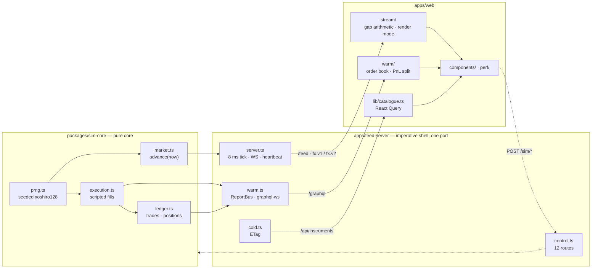
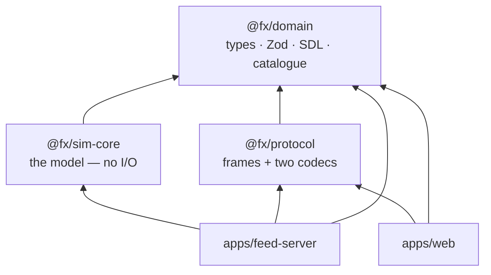
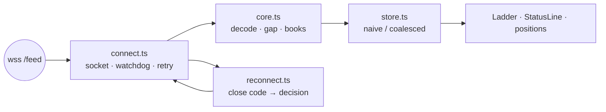
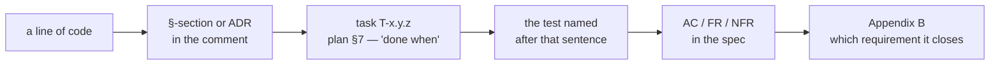

# System map

Where things live, what each one owns, and which document holds its reason.

This is a **navigation** document, not an explanation. It answers "where is
the thing that does X, and why does it exist" in one hop; the argument behind
every answer lives in [FX_BACKEND_ARCHITECTURE.md](FX_BACKEND_ARCHITECTURE.md)
(§-sections and ADRs), the schedule in
[IMPLEMENTATION_PLAN.md](IMPLEMENTATION_PLAN.md) (task ids), and the
requirement in [FX_LADDER_BUSINESS_SPEC_EN.md](FX_LADDER_BUSINESS_SPEC_EN.md)
(FR/NFR/AC ids). Nothing here restates them.

---

## 1. The whole system on one screen

Three transports because there are three data temperatures with **incompatible
delivery guarantees** (§3, ADR-02) — not because three is a nicer number than
one:

| Plane | Path | Guarantee | Loss is… |
|---|---|---|---|
| **hot** — prices | `/feed` (WS frames) | last state wins | acceptable, and *provable* via dense seq (§6.2) |
| **warm** — order events | `/graphql` (graphql-ws) | every event exactly once | never acceptable — the queue is unbounded (§7.3) |
| **cold** — catalogue | `/api/instruments` | cacheable, revalidated | irrelevant — it is a constant with an ETag (§7.2) |

Plus a fourth, which is not a data plane at all: **`/sim/*`** — the control
plane (§8). It exists so tests and demos can *command* the world instead of
waiting for luck.

---

## 2. The rule that shapes the tree

Arrows read **depends on**. Two invariants hold this shape, and neither is a
convention — both are executable (`tools/lint/boundaries.test.ts`, §4):

1. **Nothing depends on an app.** Packages never import `apps/*`.
2. **`sim-core` is pure.** No `node:`, no DOM, no timers, no ambient clock, no
   ambient randomness. Time and entropy arrive as **arguments** — which is
   what makes `advance(now)` replayable and the 100 % coverage gate reachable
   without a single mock.

The client re-imports the *same* `@fx/domain`, so the contract exists in one
copy and cannot drift from itself (ADR-01).

---

## 3. Packages

### `packages/domain` — the shared vocabulary

Everything both sides must agree on. No behaviour beyond total functions.

| File | Owns | Reason |
|---|---|---|
| [instruments.ts](packages/domain/src/instruments.ts) | the catalogue — 12 pairs across three tiers, `precision`, `pipDigit`, `INSTRUMENTS_MAX_AGE_S` | §7.2 — server `max-age` and client `staleTime` read **one** constant |
| [price.ts](packages/domain/src/price.ts) | `toPipettes` / `formatPrice` — decimal *strings* ↔ integer pipettes | ADR-06, §5.2 |
| [orders.ts](packages/domain/src/orders.ts) | `ExecType` vs `OrdStatus`, `nextOrdStatus`, `applyReport`, `MAX_ORDER_QTY_K` | §5.6 — the FIX grammar, and the invariant `cumQty + leavesQty = orderQty`; the size ceiling lives here because the Zod body, the engine and the client all have to agree on it |
| [schemas.ts](packages/domain/src/schemas.ts) | one strict Zod body per `/sim/*` route | §8 — parse, don't validate; unknown key = 400 |
| [graphql.ts](packages/domain/src/graphql.ts) | the SDL | §7.3, ADR-05 — enum names match the TS unions, so no mapping layer can drift |
| [scenarios.ts](packages/domain/src/scenarios.ts) | `DEMO_5MIN` as 11 data rows | §8 — the demo is data, and the same timeline backs the E2E suites |
| [percentile.ts](packages/domain/src/percentile.ts) | nearest-rank percentile | both perf instruments speak one arithmetic |

### `packages/sim-core` — the model

Pure. 100 % coverage gate. This is where "functional core, imperative shell"
is literal.

| File | Owns | Reason |
|---|---|---|
| [prng.ts](packages/sim-core/src/prng.ts) | xoshiro128\*\*, state serialisable to 4×uint32 | §5.1 — a stream resumes from any point, not only from the start |
| [market.ts](packages/sim-core/src/market.ts) | bounded walk, spread, book, `advance(now) → LevelRecord[]` | §5.2–5.4 — records carry **no seq**; numbering is the server's last step |
| [execution.ts](packages/sim-core/src/execution.ts) | scripted fills, last look, IOC leftovers | §5.5, withdrawn ADR-04 — every emitted report is folded through the domain validator, so an illegal sequence cannot leave the module |
| [ledger.ts](packages/sim-core/src/ledger.ts) | trades, average-cost positions, **realised** P&L | §7.3 — realised is server-owned; unrealised never lives here |

### `packages/protocol` — the wire

| File | Owns | Reason |
|---|---|---|
| [frames.ts](packages/protocol/src/frames.ts) | `assembleFrame`, JSON codec (`fx.v1`), binary codec (`fx.v2`), `PREFERRED_SUBPROTOCOLS` | §6.1 frames not messages · §6.2 seq assigned **last** · ADR-12 the second codec |

Two facts worth carrying in your head, because most of the client's design
follows from them:

- a record is a **full upsert** of one book level, so applying it twice is
  safe and applying only the last of several is legal;
- seq is assembled last in the pipeline, so a hole means transport loss
  **always** — the client's gap detector is arithmetic, not a heuristic.

---

## 4. `apps/feed-server` — the shell

One process, one port, four paths. Everything with a clock or a socket lives
here and nowhere else.

| File | Owns | Reason |
|---|---|---|
| [index.ts](apps/feed-server/src/index.ts) | bootstrap — 17 lines | — |
| [config.ts](apps/feed-server/src/config.ts) | env → config, Origin allowlist, optional `FX_SIM_SECRET` | §7.1, §14 risk 1 |
| [server.ts](apps/feed-server/src/server.ts) | the 8 ms tick, WS hot plane, heartbeat, close codes, slow-client guard, order/blotter/scenario execution, telemetry | §6–§7.1 — the only file that both keeps time and owns sockets |
| [control.ts](apps/feed-server/src/control.ts) | 12 `/sim/*` routes, `FieldError` → field-level 400 | §8 |
| [cold.ts](apps/feed-server/src/cold.ts) | `/api/instruments`, strong ETag with **weak** comparison | §7.2 — the proxy degrades strong tags in transit (RFC 7232) |
| [warm.ts](apps/feed-server/src/warm.ts) | `ReportBus` (unbounded FIFO per subscriber), graphql-ws, `orders` snapshot query | §7.3, ADR-05, ADR-08 |

Five constants in `server.ts` each encode a lesson, and each is commented with
the number that bought it:

| Constant | Value | Bought by |
|---|---|---|
| `UNBATCHED_MAX_FRAMES_PER_TICK` | 16 | a production instance killed by `batch:false` (§14, v0.4.1) |
| `BLOTTER_SPREAD_MS` | 5000 | 17 s of lockstep play-out starving `/healthz` (v1.2.1) |
| `MAX_LIVE_ORDERS` | 10 000 | one crude guardrail, §8 style |
| `ENGINE_SEED_SALT` | `0x9e37_79b9` | order flow must not perturb the market's stream, or `/sim/seed` bit-identity would depend on order timing |
| `BLOTTER_SEED_SALT` | `0x85eb_ca6b` | same reason, third stream |

---

## 5. `apps/web` — the client

Three layers matching the three planes, plus the composition on top.

### `stream/` — hot plane

| File | Owns | Reason |
|---|---|---|
| [core.ts](apps/web/src/stream/core.ts) | sans-I/O: `onMessage` / `onTick`, gap arithmetic, both decoders, byte meter | §6.2 — replayable against recorded fixtures, no mocks, no fake timers |
| [connect.ts](apps/web/src/stream/connect.ts) | the socket, the watchdog, subprotocol offer `[fx.v2, fx.v1]` | ADR-12 · a resync closes deliberately and bypasses the code table |
| [reconnect.ts](apps/web/src/stream/reconnect.ts) | pure per-close-code decision table | §7.1 — jitter is an argument, so the policy tests without timers |
| [store.ts](apps/web/src/stream/store.ts) | **the render-mode switch** + `renderStats` | §6.4 — the centrepiece: *how* state reaches React is a mode, and the difference is measured live (797×) |

### `warm/` — order lifecycle

| File | Owns | Reason |
|---|---|---|
| [client.ts](apps/web/src/warm/client.ts) | Apollo over one WS, `onReconnect` hook | ADR-05 — the place a production system would split HTTP/WS is marked here in comment |
| [orders.ts](apps/web/src/warm/orders.ts) | client order book: fold, dedup by `eventSeq`, resync queue, bounded capacity, `takeChanged()` | ADR-08 retold — loss and duplication impossible by arithmetic; capacity by measurement (v1.2.1) |
| [Blotter.tsx](apps/web/src/warm/Blotter.tsx) | AG Grid via **transactions**, `tif` column, the cancel sentence | AC-10/AC-11 — a flush costs what moved, not what the book holds |
| [TradingPanel.tsx](apps/web/src/warm/TradingPanel.tsx) | ticket, positions, subscription bridge (`ignoreResults`), resync orchestration | §7.3, T-0.4.5/8 |
| [pnl.ts](apps/web/src/warm/pnl.ts) | unrealised = position × hot mid | §7.3 — pushing it through GraphQL would drag hot tempo through the warm channel |

### `lib/` and `components/` and `perf/`

| File | Owns | Reason |
|---|---|---|
| [lib/backend.ts](apps/web/src/lib/backend.ts) | origin resolution — static site and container are different domains | §9 |
| [lib/catalogue.ts](apps/web/src/lib/catalogue.ts) | cold plane client, explicit `If-None-Match` | §7.2 — the 304 is observable, not hidden in a cache jsdom lacks |
| [lib/wake.ts](apps/web/src/lib/wake.ts) | knock on `/healthz` until it answers | ADR-11 revision — free tier sleeps |
| [lib/depth.ts](apps/web/src/lib/depth.ts) | cumulative volume, the VWAP of a walk, and what a clicked level asks the ticket for | FR-05/06/07 — pure, so the walk invariants are tested against the real seeded book |
| [components/Depth.tsx](apps/web/src/components/Depth.tsx) | the depth panel: four levels a side, clickable, one pair at a time | §5.4 — the client the wire's depth was justified by; subscribes to one pair's counter like a ladder row |
| [components/App.tsx](apps/web/src/components/App.tsx) | composition and nothing else | AC-12 — every widget behind its own boundary |
| [components/Ladder.tsx](apps/web/src/components/Ladder.tsx) | per-pair `useSyncExternalStore`, `STALE_AFTER_MS` | NFR-03 · AC-06 — one pair's update re-renders exactly one row; frozen ≠ disconnected |
| [components/StatusLine.tsx](apps/web/src/components/StatusLine.tsx) | label, colour, rate unit as pure projections | testable without a socket |
| [components/Panel.tsx](apps/web/src/components/Panel.tsx) | the demo panel — every `/sim/*` line, plus the render switch | T-0.2.7 — no curl, no DevTools |
| [components/Boundary.tsx](apps/web/src/components/Boundary.tsx) | the **only class** in the codebase | AC-12 — React gives error boundaries no hook |
| [perf/series.ts](apps/web/src/perf/series.ts) | chart arithmetic, sans-I/O; rates differentiated against the **server's** clock | a paused tab or a slow poll skews nothing |
| [perf/LoadChart.tsx](apps/web/src/perf/LoadChart.tsx) | four hand-drawn SVG small multiples | AC-01 in one picture: load goes up, cost does not |

---

## 6. Tools — the executable arguments

Everything here exists to make a claim checkable by one command.

| Path | Command | Proves |
|---|---|---|
| [tools/lint/](tools/lint/boundaries.test.ts) | `pnpm verify` | the two dependency invariants — with fixtures that must fail |
| [tools/fixtures/](tools/fixtures/) | `pnpm verify` | recorded frame streams, drift-gated |
| [tools/api-docs/](tools/api-docs/) | `pnpm docs:api` | OpenAPI 3.1 + AsyncAPI 3 generated **from the live Zod schemas**, drift-gated |
| [tools/perf/gate.ts](tools/perf/gate.ts) | `pnpm gate:perf` | the README numbers — both wires × both render modes |
| [tools/chaos/drill.ts](tools/chaos/drill.ts) | `pnpm chaos:drill` | SIGKILL mid-stream → clients come back ([CHAOS.md](CHAOS.md)) |
| [tools/rehearsal/rehearse.ts](tools/rehearsal/rehearse.ts) | `pnpm rehearse` | the [DEMO.md](DEMO.md) script end to end, throttled |
| [e2e/](e2e/) | `pnpm test:e2e` | 8 specs — mvp, blotter, blotter-reason, journey, keyboard, load-chart, reconnect, wire |

---

## 7. Untangling causality: the chain

Every artefact carries a pointer to the next layer up. Follow it.

Practically:

- an unfamiliar comment says `§6.2` → read §6.2;
- it says `T-0.4.6` → read that task's **done when** in plan §7, then
  `grep "done-when of T-0.4.6"` — the test *is* the recorded reason;
- it says nothing → check `git log -S` / `git blame` → the PR body, which
  carries an **Assumptions** section and the measurement.

**The root of the chain** is the eight-statement checklist at the end of
[FX_BACKEND_ARCHITECTURE.md](FX_BACKEND_ARCHITECTURE.md) —
*"Мінімум, який цей бекенд мусить довести"*. Every piece of this system exists
to make one of them true:

| # | Statement | Where it lives |
|---|---|---|
| 1 | frames, not messages | `frames.ts` · `server.ts` tick · perf gate |
| 2 | dense seq | `assembleFrame` · `stream/core.ts` gap arithmetic |
| 3 | heartbeat | `server.ts` sweep · `connect.ts` watchdog |
| 4 | close codes | `reconnect.ts` table · `e2e/reconnect.spec.ts` |
| 5 | prices are integer pipettes | `price.ts` · the one formatter in the render |
| 6 | three planes, three guarantees | `ReportBus` unbounded vs hot-plane frames |
| 7 | pure core | `tools/lint` · 100 % coverage on `sim-core` |
| 8 | demo on a real network | `render.yaml` · [DEPLOY.md](DEPLOY.md) · `wake.ts` |

If a piece of code maps to **none** of the eight, that is a signal, not a
gap in this table: either it is incidental (machine quirks belong in
[DEPLOY.md](DEPLOY.md), not in the architecture), or it is debt worth naming
out loud.

The chain runs the other way too, and that direction catches more: a
**requirement** with no code, no test and no withdrawn ADR is a hole. FR-05,
FR-06 and FR-07 sat that way for four releases — the wire carried the depth,
the core stored it, and nothing drew it — until v1.3.0. Reading the spec's
FR list against `grep` is a cheap audit, and it is the one this map exists
to make possible.

---

## 8. Start here for a given change

| You want to change… | Touch, in this order |
|---|---|
| how prices move | `sim-core/market.ts` → its test → nothing else; the wire does not care |
| what an order does | `domain/orders.ts` (grammar) → `sim-core/execution.ts` (script) → `warm.ts` (enrichment) → `warm/orders.ts` (fold) |
| the wire format | `protocol/frames.ts` **only** — then the golden-bytes test; seq must stay last in the pipeline |
| a `/sim/*` endpoint | `domain/schemas.ts` → `control.ts` → `server.ts` handler → `pnpm docs:api` (drift gate will fail otherwise) |
| what the blotter shows | `warm/Blotter.tsx` columns → `warm/orders.ts` if the datum is not on the row yet → the wire if it is not on the wire yet |
| the depth panel | `lib/depth.ts` for the arithmetic → `components/Depth.tsx` for the drawing; the book is already on the client, so neither the wire nor the server is involved |
| how fast the screen updates | `stream/store.ts` — and *only* there; the core never lags the wire by design |
| the demo script | `domain/scenarios.ts` (data) → [DEMO.md](DEMO.md) → `tools/rehearsal` |
| deployment | `render.yaml` → `.github/workflows/release.yml` → [DEPLOY.md](DEPLOY.md) |

---

## 9. What is absent on purpose

The most common reading error in this repo is treating an absence as an
oversight. Each of these has a **withdrawn ADR** stating context, reason and
price — §12:

| Absent | ADR | One-line reason |
|---|---|---|
| a real matching engine | ADR-04 | the client cannot tell where a fill came from; the value is in the event *grammar*, not the mechanics |
| conflation | ADR-07 | generation never outruns sending at these rates — and the rule it existed to protect (numbering last) survived on its own |
| graceful slow-consumer degradation | ADR-09 | the threshold and close code stayed; the snapshot-only step needed per-client mode state nobody would watch |
| a database | ADR-10 | no FR survives a restart; a restart **is** a new trading day, and the page says so |
| a second core host (Web Worker) | ADR-03 | every role it had is covered more cheaply once the demo lives in the cloud |

---

*Kept current by hand. When a file moves and this map does not, the map is
wrong — fix it in the same commit.*
